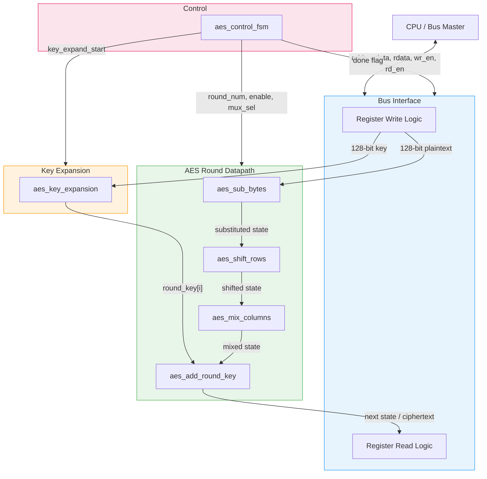
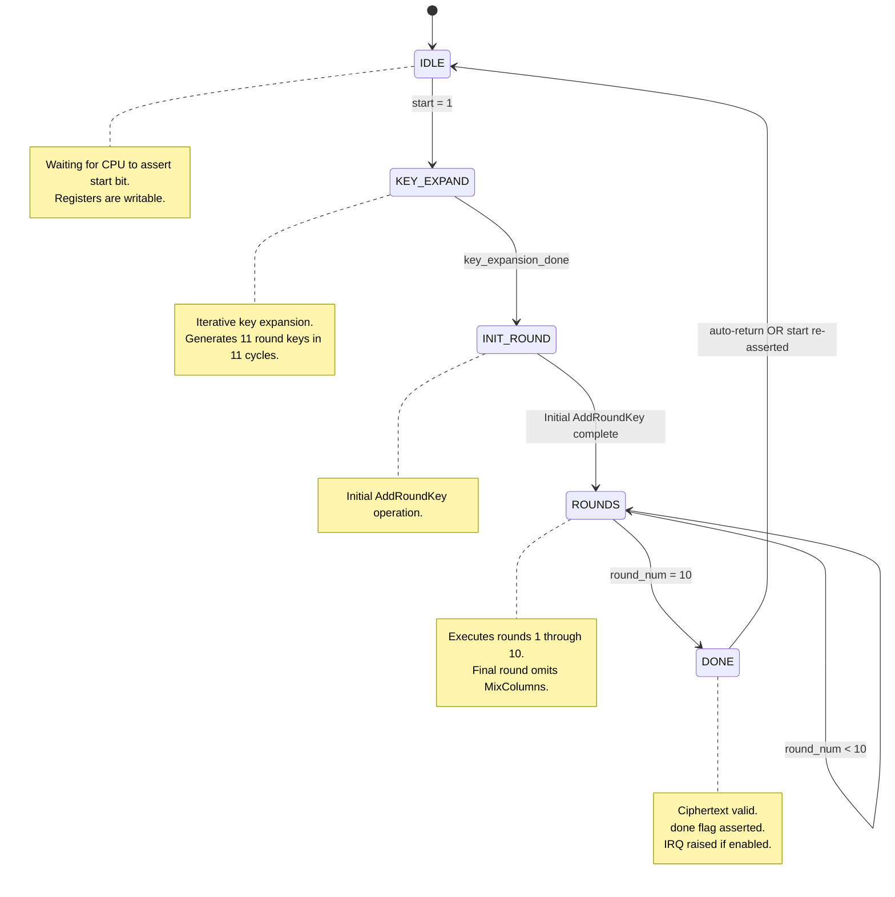
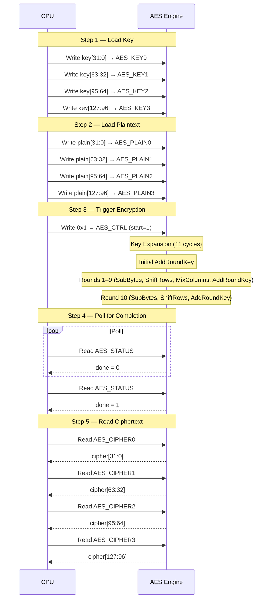

# AES-128 Encryption Engine

> **RISC-Shield SoC — Hardware Accelerator Documentation**
>
> Module path: `rtl/accelerators/aes/`
> Bus interface: Memory-mapped (simple bus)
> Specification: FIPS 197 — Advanced Encryption Standard (AES)

---

## Table of Contents

1. [Overview](#overview)
2. [AES-128 Algorithm Summary](#aes-128-algorithm-summary)
3. [Architecture Block Diagram](#architecture-block-diagram)
4. [Module Descriptions](#module-descriptions)
5. [FSM State Diagram](#fsm-state-diagram)
6. [Data Flow — Software Perspective](#data-flow--software-perspective)
7. [Register Interface](#register-interface)
8. [Timing Analysis](#timing-analysis)
9. [Verification Strategy](#verification-strategy)
10. [Design Notes & Future Work](#design-notes--future-work)

---

## Overview

The AES-128 engine is a **hardware encryption accelerator** integrated into the RISC-Shield SoC. It implements the AES block cipher in **encryption-only** mode with a fixed key length of **128 bits** (FIPS 197).

### Key Characteristics

| Parameter            | Value                          |
|----------------------|--------------------------------|
| Algorithm            | AES (Rijndael)                 |
| Key length           | 128 bits                       |
| Block size           | 128 bits                       |
| Mode                 | Encryption only (ECB)          |
| Number of rounds     | 10                             |
| Interface            | Memory-mapped registers        |
| Implementation style | Iterative (1 round per cycle)  |

### Operational Summary

The CPU interacts with the AES engine through a simple memory-mapped register interface:

1. Write a **128-bit cipher key** into four 32-bit key registers.
2. Write a **128-bit plaintext block** into four 32-bit plaintext registers.
3. Set the **start** bit in the control register.
4. Poll the **done** flag in the status register (or wait for an interrupt, if enabled).
5. Read the **128-bit ciphertext** from four 32-bit ciphertext registers.

The engine handles key expansion internally and executes all 10 AES rounds autonomously once triggered.

---

## AES-128 Algorithm Summary

AES-128 encrypts a 128-bit plaintext block using a 128-bit key through **10 iterative rounds**. The 128-bit data block is represented as a **4×4 byte state matrix** (column-major order).

### Round Structure

Each of the 10 rounds applies four transformations to the state:

| Step           | Description                                                                                         |
|----------------|-----------------------------------------------------------------------------------------------------|
| **SubBytes**   | Non-linear byte substitution using a fixed 256-entry S-Box lookup table.                            |
| **ShiftRows**  | Cyclic left-shift of each row: Row 0 → no shift, Row 1 → 1 byte, Row 2 → 2 bytes, Row 3 → 3 bytes.|
| **MixColumns** | Matrix multiplication over GF(2⁸) on each column of the state matrix.                              |
| **AddRoundKey**| Bitwise XOR of the state with the current round key.                                                |

> [!IMPORTANT]
> The **final round (Round 10)** omits the MixColumns step. This is part of the AES specification and must be handled correctly in hardware.

### Key Expansion

The 128-bit cipher key is expanded into **11 round keys** (one initial + ten round keys), each 128 bits wide. Key expansion uses:

- **RotWord**: Cyclic left rotation of a 4-byte word.
- **SubWord**: S-Box substitution applied to each byte of a 4-byte word.
- **Rcon**: Round constant XOR (a pre-defined constant per round).

The initial round key (Round 0) is the original cipher key itself. Each subsequent round key is derived from the previous one.

### State Matrix Layout

The 128-bit block is arranged in a 4×4 matrix of bytes in **column-major** order:

```
Input bytes:  b0  b1  b2  b3  b4  b5  b6  b7  b8  b9  b10 b11 b12 b13 b14 b15

State matrix:
        Col 0   Col 1   Col 2   Col 3
Row 0 [  b0      b4      b8      b12  ]
Row 1 [  b1      b5      b9      b13  ]
Row 2 [  b2      b6      b10     b14  ]
Row 3 [  b3      b7      b11     b15  ]
```

---

## Architecture Block Diagram



### Signal Flow Summary

1. The **Bus Interface** latches key and plaintext from CPU writes into internal registers.
2. The **Control FSM** orchestrates the sequence: key expansion → 10 encryption rounds → done.
3. The **Key Expansion** module generates round keys on demand (one per clock cycle in iterative mode).
4. The **Round Datapath** processes the state through SubBytes → ShiftRows → MixColumns → AddRoundKey.
5. After Round 10 completes, the ciphertext is available in the output registers.

---

## Module Descriptions

### `aes_sbox.v`

| Property       | Detail                                                    |
|----------------|-----------------------------------------------------------|
| **Function**   | AES S-Box substitution lookup                             |
| **Type**       | Combinational                                             |
| **Input**      | `byte_in [7:0]` — 8-bit input byte                       |
| **Output**     | `byte_out [7:0]` — 8-bit substituted byte                |
| **Implementation** | 256-entry lookup table (`case` statement or ROM)      |

The S-Box provides the non-linear substitution step of AES. It is defined by the multiplicative inverse in GF(2⁸) followed by an affine transformation. The lookup table is fixed and specified in FIPS 197.

```
// Example S-Box entries (hexadecimal)
// Input 0x00 → Output 0x63
// Input 0x01 → Output 0x7C
// Input 0x53 → Output 0xED
// ...full 256-entry table per FIPS 197, Table Appendix B
```

---

### `aes_sub_bytes.v`

| Property       | Detail                                                     |
|----------------|-------------------------------------------------------------|
| **Function**   | Apply S-Box to all 16 bytes of the state                    |
| **Type**       | Combinational                                               |
| **Input**      | `state_in [127:0]` — 128-bit input state                   |
| **Output**     | `state_out [127:0]` — 128-bit substituted state             |
| **Sub-modules**| 16 × `aes_sbox` instances                                  |

Each byte of the 4×4 state matrix is independently substituted through its own S-Box instance. All 16 substitutions occur in parallel (combinational).

```
state_out[ 7: 0] = sbox(state_in[ 7: 0])   // Byte 0
state_out[15: 8] = sbox(state_in[15: 8])   // Byte 1
...
state_out[127:120] = sbox(state_in[127:120]) // Byte 15
```

---

### `aes_shift_rows.v`

| Property       | Detail                                                     |
|----------------|-------------------------------------------------------------|
| **Function**   | Cyclic left-shift of state matrix rows                      |
| **Type**       | Combinational (wiring only — no logic gates required)       |
| **Input**      | `state_in [127:0]`                                          |
| **Output**     | `state_out [127:0]`                                         |

The shift amounts are fixed per the AES specification:

| Row | Shift (bytes left) | Description              |
|-----|-------------------|--------------------------|
| 0   | 0                 | No change                |
| 1   | 1                 | Shift left by 1 byte     |
| 2   | 2                 | Shift left by 2 bytes    |
| 3   | 3                 | Shift left by 3 bytes    |

This transformation is implemented purely through wire re-ordering — no computational logic is needed.

---

### `aes_mix_columns.v`

| Property       | Detail                                                      |
|----------------|--------------------------------------------------------------|
| **Function**   | GF(2⁸) matrix multiplication on each state column            |
| **Type**       | Combinational                                                |
| **Input**      | `state_in [127:0]`                                           |
| **Output**     | `state_out [127:0]`                                          |

Each column of the state matrix is treated as a polynomial over GF(2⁸) and multiplied by the fixed polynomial `{03}x³ + {01}x² + {01}x + {02}`:

```
┌          ┐   ┌                ┐   ┌    ┐
│ s'(0,c)  │   │ 02  03  01  01 │   │ s(0,c) │
│ s'(1,c)  │ = │ 01  02  03  01 │ × │ s(1,c) │
│ s'(2,c)  │   │ 01  01  02  03 │   │ s(2,c) │
│ s'(3,c)  │   │ 03  01  01  02 │   │ s(3,c) │
└          ┘   └                ┘   └    ┘
```

Multiplication by `{02}` is implemented as a left-shift with conditional XOR of `0x1B` (the AES irreducible polynomial). Multiplication by `{03}` is `{02} ⊕ {01}` (xtime plus XOR).

> [!NOTE]
> MixColumns operates on all 4 columns independently. The four column computations can be fully parallelized in hardware.

---

### `aes_add_round_key.v`

| Property       | Detail                                                     |
|----------------|-------------------------------------------------------------|
| **Function**   | XOR state with current round key                            |
| **Type**       | Combinational                                               |
| **Input**      | `state_in [127:0]`, `round_key [127:0]`                    |
| **Output**     | `state_out [127:0]`                                         |

The simplest AES transformation — a bitwise XOR between the 128-bit state and the 128-bit round key:

```verilog
assign state_out = state_in ^ round_key;
```

This operation is used in every round, including the initial "Round 0" key addition applied before the first round.

---

### `aes_key_expansion.v`

| Property       | Detail                                                      |
|----------------|--------------------------------------------------------------|
| **Function**   | Expand 128-bit cipher key into 11 × 128-bit round keys      |
| **Type**       | Sequential (iterative) or Combinational (precomputed)        |
| **Input**      | `cipher_key [127:0]`, `start`, `clk`, `rst_n`               |
| **Output**     | `round_key [127:0]`, `key_valid`, `key_round [3:0]`         |

Key expansion generates the round key schedule from the original 128-bit key. The implementation can follow one of two strategies:

| Strategy       | Description                                   | Area  | Latency      |
|----------------|-----------------------------------------------|-------|--------------|
| **Iterative**  | Compute one round key per clock cycle          | Lower | 11 cycles    |
| **Precomputed**| Compute all 11 keys combinationally in one step| Higher| 0 extra cycles|

**Iterative approach (recommended for area-constrained SoC):**

The key expansion FSM generates one 128-bit round key per clock cycle. Each 128-bit key consists of four 32-bit words `W[i]` to `W[i+3]`:

```
For each round i (1..10):
    temp = W[i-1]
    temp = SubWord(RotWord(temp)) ⊕ Rcon[i]    // for word 0 of each round key
    W[i*4 + 0] = W[(i-1)*4 + 0] ⊕ temp
    W[i*4 + 1] = W[(i-1)*4 + 1] ⊕ W[i*4 + 0]
    W[i*4 + 2] = W[(i-1)*4 + 2] ⊕ W[i*4 + 1]
    W[i*4 + 3] = W[(i-1)*4 + 3] ⊕ W[i*4 + 2]
```

**Round Constants (Rcon):**

| Round | Rcon (hex)   |
|-------|-------------|
| 1     | `0x01000000` |
| 2     | `0x02000000` |
| 3     | `0x04000000` |
| 4     | `0x08000000` |
| 5     | `0x10000000` |
| 6     | `0x20000000` |
| 7     | `0x40000000` |
| 8     | `0x80000000` |
| 9     | `0x1B000000` |
| 10    | `0x36000000` |

---

### `aes_round.v`

| Property       | Detail                                                      |
|----------------|--------------------------------------------------------------|
| **Function**   | One complete AES encryption round                            |
| **Type**       | Combinational                                                |
| **Input**      | `state_in [127:0]`, `round_key [127:0]`, `is_final_round`   |
| **Output**     | `state_out [127:0]`                                          |
| **Sub-modules**| `aes_sub_bytes`, `aes_shift_rows`, `aes_mix_columns`, `aes_add_round_key` |

This module chains the four AES transformations for a single round:

```
state → SubBytes → ShiftRows → MixColumns* → AddRoundKey → next_state
                                   ↑
                          Bypassed in final round
```

The `is_final_round` control signal selects whether MixColumns is applied:

```verilog
// Pseudocode
wire [127:0] after_sub   = sub_bytes(state_in);
wire [127:0] after_shift = shift_rows(after_sub);
wire [127:0] after_mix   = is_final_round ? after_shift : mix_columns(after_shift);
assign state_out = after_mix ^ round_key;
```

---

### `aes_control_fsm.v`

| Property       | Detail                                                      |
|----------------|--------------------------------------------------------------|
| **Function**   | Orchestrates key expansion and 10 encryption rounds          |
| **Type**       | Sequential (clocked FSM)                                     |
| **Input**      | `clk`, `rst_n`, `start`, `key_valid`                        |
| **Output**     | `round_num [3:0]`, `is_final_round`, `done`, `key_expand_start`, `state_en` |

The FSM manages the entire encryption lifecycle from start trigger to done assertion.

**States:**

| State          | Encoding | Description                                             |
|----------------|----------|---------------------------------------------------------|
| `IDLE`         | `3'b000` | Waiting for `start` signal                              |
| `KEY_EXPAND`   | `3'b001` | Key expansion in progress (11 cycles for iterative)     |
| `INIT_ROUND`   | `3'b010` | Initial AddRoundKey (Round 0 key addition)              |
| `ROUNDS`       | `3'b011` | Executing Rounds 1–10 (round counter increments)        |
| `DONE`         | `3'b100` | Encryption complete; ciphertext valid                   |

---

### `aes_top.v`

| Property       | Detail                                                      |
|----------------|--------------------------------------------------------------|
| **Function**   | Top-level AES module with bus interface                       |
| **Type**       | Sequential + Combinational                                   |
| **Bus signals**| `addr`, `wdata`, `rdata`, `wr_en`, `rd_en`, `ready`        |
| **Sub-modules**| `aes_control_fsm`, `aes_key_expansion`, `aes_round`         |

Top-level module that integrates:
- Register file for key, plaintext, ciphertext, control, and status
- AES datapath (round logic)
- Key expansion unit
- Control FSM
- Bus interface decode logic

#### Port List

```verilog
module aes_top (
    input  wire        clk,
    input  wire        rst_n,

    // Bus interface
    input  wire [31:0] addr,
    input  wire [31:0] wdata,
    output reg  [31:0] rdata,
    input  wire        wr_en,
    input  wire        rd_en,
    output wire        ready,

    // Optional interrupt
    output wire        aes_irq
);
```

---

## FSM State Diagram



---

## Data Flow — Software Perspective

The following sequence describes the complete encryption flow from the CPU's perspective:



### Step-by-Step Breakdown

| Step | Action                          | Registers Used                | Direction |
|------|---------------------------------|-------------------------------|-----------|
| 1    | Write 128-bit cipher key        | `AES_KEY0` – `AES_KEY3`       | CPU → AES |
| 2    | Write 128-bit plaintext         | `AES_PLAIN0` – `AES_PLAIN3`   | CPU → AES |
| 3    | Assert start bit                | `AES_CTRL.start`              | CPU → AES |
| 4    | Engine performs key expansion    | Internal                      | —         |
| 5    | Engine executes 10 AES rounds   | Internal                      | —         |
| 6    | Done flag is asserted            | `AES_STATUS.done`             | AES → CPU |
| 7    | Read 128-bit ciphertext         | `AES_CIPHER0` – `AES_CIPHER3` | AES → CPU |

---

## Register Interface

All AES registers are accessible through the SoC memory map. Refer to [memory_map.md](memory_map.md) for base address assignments.

> [!NOTE]
> The suggested base address for the AES engine is `0x5000_0000`. All offsets below are relative to this base.

### Register Map

| Offset  | Name          | Width | Access | Description                          |
|---------|---------------|-------|--------|--------------------------------------|
| `0x00`  | `AES_KEY0`    | 32    | R/W    | Key bits [31:0]                      |
| `0x04`  | `AES_KEY1`    | 32    | R/W    | Key bits [63:32]                     |
| `0x08`  | `AES_KEY2`    | 32    | R/W    | Key bits [95:64]                     |
| `0x0C`  | `AES_KEY3`    | 32    | R/W    | Key bits [127:96]                    |
| `0x10`  | `AES_PLAIN0`  | 32    | R/W    | Plaintext bits [31:0]                |
| `0x14`  | `AES_PLAIN1`  | 32    | R/W    | Plaintext bits [63:32]               |
| `0x18`  | `AES_PLAIN2`  | 32    | R/W    | Plaintext bits [95:64]               |
| `0x1C`  | `AES_PLAIN3`  | 32    | R/W    | Plaintext bits [127:96]              |
| `0x20`  | `AES_CIPHER0` | 32    | R      | Ciphertext bits [31:0]               |
| `0x24`  | `AES_CIPHER1` | 32    | R      | Ciphertext bits [63:32]              |
| `0x28`  | `AES_CIPHER2` | 32    | R      | Ciphertext bits [95:64]              |
| `0x2C`  | `AES_CIPHER3` | 32    | R      | Ciphertext bits [127:96]             |
| `0x30`  | `AES_CTRL`    | 32    | R/W    | Control register                     |
| `0x34`  | `AES_STATUS`  | 32    | R      | Status register                      |

### AES_CTRL Register (Offset `0x30`)

| Bit(s) | Field     | Access | Reset | Description                                |
|--------|-----------|--------|-------|--------------------------------------------|
| 0      | `start`   | R/W    | 0     | Write `1` to begin encryption. Self-clears.|
| 1      | `irq_en`  | R/W    | 0     | Enable interrupt on completion.            |
| 31:2   | Reserved  | —      | 0     | Reserved for future use.                   |

### AES_STATUS Register (Offset `0x34`)

| Bit(s) | Field     | Access | Reset | Description                                |
|--------|-----------|--------|-------|--------------------------------------------|
| 0      | `done`    | R      | 0     | Asserted when encryption is complete.      |
| 1      | `busy`    | R      | 0     | Asserted while engine is active.           |
| 31:2   | Reserved  | —      | 0     | Reserved.                                  |

---

## Timing Analysis

### Cycle Count Breakdown

| Phase                     | Cycles | Description                                  |
|---------------------------|--------|----------------------------------------------|
| Key Expansion             | 11     | 1 cycle per round key (iterative)            |
| Initial AddRoundKey       | 1      | Round 0 key addition                         |
| Rounds 1–10               | 10     | 1 cycle per round (registered datapath)      |
| **Total (iterative)**     | **~22**| From `start` assertion to `done` assertion   |

> [!TIP]
> If key expansion is **precomputed** (all round keys generated combinationally), the total latency reduces to approximately **12 cycles** (1 initial + 10 rounds + 1 done). This trades area for speed.

### Throughput Estimate

For a system clock of **50 MHz** (20 ns period) with iterative key expansion:

| Metric            | Value                                     |
|-------------------|-------------------------------------------|
| Latency           | 22 cycles × 20 ns = **440 ns** per block  |
| Throughput         | 128 bits / 440 ns ≈ **291 Mbps**          |
| Blocks per second | ≈ 2.27 million blocks/sec                 |

> [!NOTE]
> If the same key is reused for multiple blocks, the key expansion phase can be skipped after the first block, reducing latency to **~12 cycles (240 ns)** per subsequent block and boosting throughput to approximately **533 Mbps**.

---

## Verification Strategy

### NIST Test Vectors

The AES engine must be verified against the official **NIST AES test vectors** (FIPS 197, Appendix B):

| Test Case                          | Key (hex)                          | Plaintext (hex)                    | Expected Ciphertext (hex)          |
|------------------------------------|------------------------------------|------------------------------------|-------------------------------------|
| FIPS 197 Appendix B                | `2b7e1516 28aed2a6 abf71588 09cf4f3c` | `3243f6a8 885a308d 31319809 7f8b6339` | `3925841d 02dc09fb dc118597 196a0b32` |
| NIST SP 800-38A ECB Example 1      | `2b7e1516 28aed2a6 abf71588 09cf4f3c` | `6bc1bee2 2e409f96 e93d7e11 7393172a` | `3ad77bb4 0d7a3660 a89ecaf3 2466ef97` |
| All-zero key and plaintext         | `00000000 00000000 00000000 00000000` | `00000000 00000000 00000000 00000000` | `66e94bd4 ef8a2c3b 884cfa59 ca342b2e` |

### Testbench Architecture

```
aes_tb.v
├── Clock & reset generation
├── Bus functional model (write key, plaintext, start)
├── DUT instantiation (aes_top)
├── Monitor (poll status, read ciphertext)
├── Self-checking comparator
│   └── Compare ciphertext output vs expected (NIST vectors)
└── Pass/Fail reporting
```

### Verification Checklist

- [ ] Verify against all NIST AES-128 test vectors
- [ ] Verify `done` flag timing (asserted exactly when ciphertext is valid)
- [ ] Verify `busy` flag behavior during operation
- [ ] Test back-to-back encryption (start new encryption immediately after done)
- [ ] Test key change between encryptions
- [ ] Verify reset behavior mid-operation
- [ ] Verify register read-back of key and plaintext
- [ ] Verify ciphertext registers are read-only
- [ ] Gate-level simulation post-synthesis (if applicable)

---

## Design Notes & Future Work

### Current Limitations

- **Encryption only** — decryption is not supported in this version.
- **ECB mode only** — no CBC, CTR, or other chaining modes are implemented.
- **No DMA support** — all data transfer is via CPU register writes/reads.

### Possible Enhancements

| Enhancement             | Description                                                    | Complexity |
|-------------------------|----------------------------------------------------------------|------------|
| AES Decryption          | Add InvSubBytes, InvShiftRows, InvMixColumns for decryption   | Medium     |
| CBC / CTR Mode          | Add chaining logic for block cipher modes of operation         | Medium     |
| DMA Interface           | Allow memory-to-memory encryption without CPU intervention     | High       |
| AES-192 / AES-256       | Support larger key sizes (12/14 rounds)                       | Medium     |
| Pipeline                | Pipeline the round logic for higher throughput                 | High       |
| Side-channel protection | Add masking or hiding countermeasures                          | High       |

---

> **Document version:** 1.0
> **Last updated:** 2026-07-11
> **Author:** Aditya Patel (original design by Dhruv Singla)
