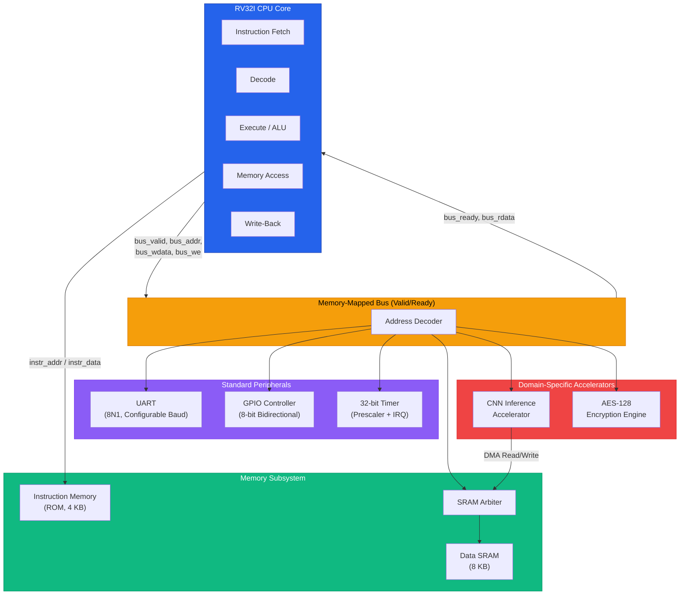
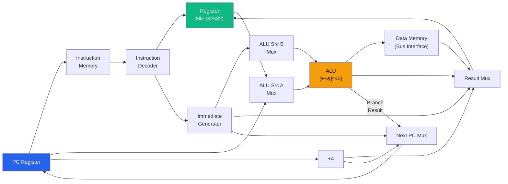
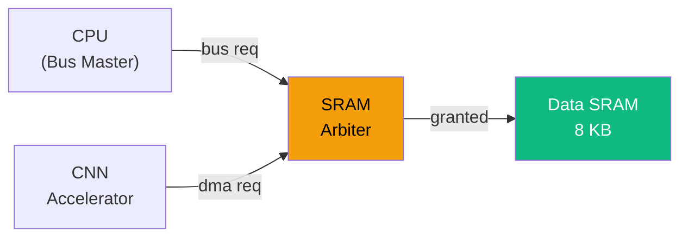
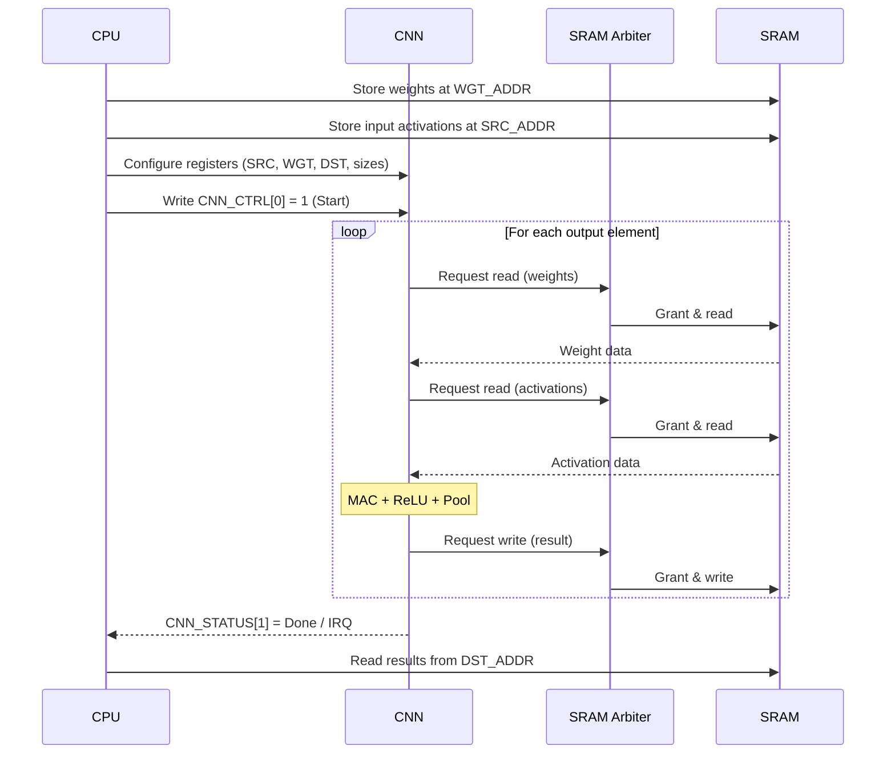
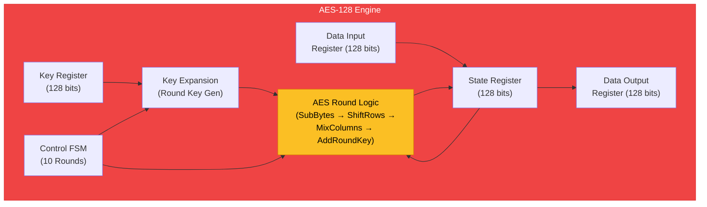
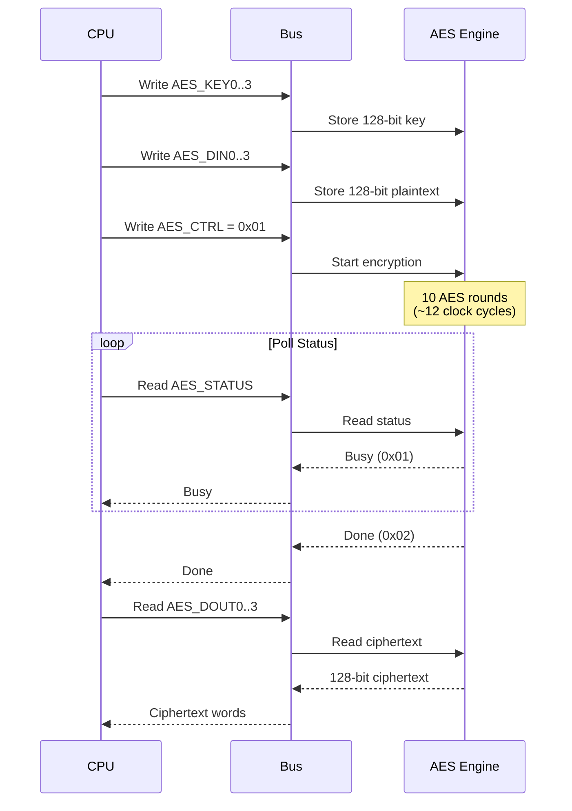
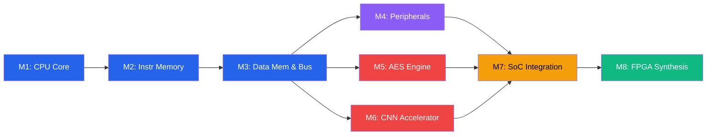

# RISC-Shield — RISC-V Edge AI Accelerator SoC

## Architecture Specification

> [!NOTE]
> This is the original architecture draft. Some details (e.g. the AES base address `0x5001_0000`, the SRAM arbiter) differ from the final implementation. The RTL in `rtl/` and [`memory_map.md`](memory_map.md) / the README memory map are authoritative — AES lives at `0x6000_0000`.

| Field          | Value                                            |
|:---------------|:-------------------------------------------------|
| **Project**    | RISC-Shield SoC                                   |
| **Version**    | 1.0                                              |
| **Author**     | Aditya Patel (original design by Dhruv Singla)   |
| **ISA**        | RISC-V RV32I (Base Integer, 32-bit)              |
| **Language**   | Synthesizable Verilog (IEEE 1364-2005)           |
| **Target**     | FPGA prototyping / educational ASIC tapeout      |
| **License**    | MIT                                              |

---

## Table of Contents

1. [Overview](#1-overview)
2. [Design Philosophy](#2-design-philosophy)
3. [SoC Block Diagram](#3-soc-block-diagram)
4. [Top-Level Signal Interface](#4-top-level-signal-interface)
5. [Clock and Reset Strategy](#5-clock-and-reset-strategy)
6. [Memory-Mapped Bus Architecture](#6-memory-mapped-bus-architecture)
7. [Component Deep-Dive](#7-component-deep-dive)
   - 7.1 [RV32I CPU Core](#71-rv32i-cpu-core)
   - 7.2 [Instruction Memory (ROM)](#72-instruction-memory-rom)
   - 7.3 [SRAM Controller & Arbiter](#73-sram-controller--arbiter)
   - 7.4 [UART Peripheral](#74-uart-peripheral)
   - 7.5 [GPIO Controller](#75-gpio-controller)
   - 7.6 [Timer / Counter](#76-timer--counter)
   - 7.7 [CNN Inference Accelerator](#77-cnn-inference-accelerator)
   - 7.8 [AES-128 Encryption Engine](#78-aes-128-encryption-engine)
8. [Memory Map & Address Decoding](#8-memory-map--address-decoding)
9. [Data Flow Examples](#9-data-flow-examples)
10. [Component Summary Table](#10-component-summary-table)
11. [Development Milestones](#11-development-milestones)
12. [Directory Structure](#12-directory-structure)

---

## 1. Overview

**RISC-Shield** is a lightweight, fully synthesizable System-on-Chip (SoC) that integrates:

- A **custom RV32I single-cycle processor** implementing the RISC-V Base Integer instruction set (37 instructions).
- A **CNN inference accelerator** for edge-AI workloads such as small image classification (e.g., MNIST-class networks).
- An **AES-128 encryption engine** for on-chip cryptographic operations.
- A suite of **standard peripherals** — UART, GPIO, and a 32-bit Timer — for host communication and general I/O.

All components communicate over a **custom memory-mapped bus** with a simple valid/ready handshake protocol. The design prioritizes clarity, correctness, and educational value while remaining fully synthesizable for FPGA targets (Xilinx Artix-7, Intel Cyclone V) and amenable to ASIC flows (e.g., OpenLane / SKY130).

```
┌──────────────────────────────────────────────────────────────┐
│                     RISC-Shield SoC                           │
│                                                              │
│   RV32I CPU  ──►  Memory-Mapped Bus  ──►  Peripherals       │
│                         │                                    │
│              ┌──────────┼──────────┐                         │
│              ▼          ▼          ▼                          │
│          Instr Mem   SRAM     CNN / AES / UART / GPIO / TMR  │
└──────────────────────────────────────────────────────────────┘
```

### Key Highlights

| Feature               | Description                                                  |
|:-----------------------|:-------------------------------------------------------------|
| ISA                    | RISC-V RV32I — 37 base integer instructions                  |
| CPU Micro-architecture | Single-cycle (CPI = 1), no pipeline, no cache                |
| Bus Protocol           | Custom valid/ready memory-mapped bus, 32-bit address/data    |
| CNN Accelerator        | MAC-array based, supports Conv2D + ReLU + Max-Pool           |
| Crypto Engine          | AES-128, ECB mode, iterative round-based architecture        |
| Peripherals            | UART (8N1), 8-bit GPIO, 32-bit Timer with interrupt          |
| Clock Domains          | Single clock domain                                          |
| Reset                  | Active-low asynchronous reset (`rst_n`)                      |

---

## 2. Design Philosophy

RISC-Shield is guided by the following principles:

### 2.1 Simplicity First

The CPU is a **single-cycle design** — every instruction completes in exactly one clock cycle. There is no pipeline, no branch predictor, no cache hierarchy, and no out-of-order logic. This makes the design easy to understand, verify, and debug, while keeping the RTL compact enough for educational purposes.

### 2.2 Fully Synthesizable Verilog

All RTL is written in IEEE 1364-2005 compliant Verilog. No `initial` blocks in synthesizable code. No vendor-specific primitives in the core design. Memories are inferred from behavioral descriptions to maintain portability.

### 2.3 Memory-Mapped Everything

Every peripheral, accelerator, and memory block is accessed through a **unified 32-bit address space**. The CPU uses standard `lw`/`sw` (load word / store word) instructions to interact with all components — there are no custom instructions or co-processor interfaces. This keeps the CPU simple and makes peripheral integration straightforward.

### 2.4 Handshake Bus Protocol

The bus uses a lightweight **valid/ready** handshake:

```
Master (CPU)                    Slave (Peripheral)
────────────                    ──────────────────
  bus_valid  ──────────────►
  bus_addr   ──────────────►
  bus_wdata  ──────────────►
  bus_we     ──────────────►
                            ◄──  bus_ready
                            ◄──  bus_rdata
```

- **bus_valid**: Master asserts to indicate a valid transaction.
- **bus_ready**: Slave asserts when data is available (reads) or write is accepted.
- A transfer completes when `bus_valid && bus_ready` are both high on the same rising clock edge.
- For single-cycle peripherals, `bus_ready` is tied high. For multi-cycle peripherals (CNN, AES), `bus_ready` is deasserted until the operation completes.

### 2.5 Modularity

Each component is a self-contained Verilog module with a well-defined bus-slave interface. Components can be independently simulated, verified, and swapped without touching the rest of the design.

---

## 3. SoC Block Diagram



### ASCII Block Diagram (Alternative View)

```
                          ┌─────────────────────────────┐
                          │        RV32I CPU Core        │
                          │  ┌─────┬─────┬─────┬─────┐  │
                          │  │ IF  │ DEC │ EX  │ WB  │  │
                          │  └─────┴─────┴─────┴─────┘  │
                          │     │instr         │bus      │
                          └─────┼──────────────┼─────────┘
                                │              │
                     ┌──────────┘              │
                     ▼                         ▼
              ┌────────────┐    ┌──────────────────────────────────┐
              │ Instr Mem  │    │     Memory-Mapped Bus Fabric     │
              │  (ROM)     │    │       (Address Decoder)          │
              │  4 KB      │    └──┬─────┬──────┬──────┬─────┬────┘
              └────────────┘       │     │      │      │     │
                    ┌──────────────┘     │      │      │     │
                    ▼                    ▼      ▼      ▼     ▼
             ┌────────────┐         ┌──────┐┌─────┐┌─────┐┌─────┐
             │SRAM Arbiter│◄──┐     │ UART ││GPIO ││Timer││ AES │
             └─────┬──────┘   │     └──────┘└─────┘└─────┘└─────┘
                   │          │
                   ▼          │
             ┌──────────┐    │
             │ Data SRAM │    │
             │  (8 KB)   │    │
             └──────────┘    │
                             │
                    ┌────────┴────────┐
                    │ CNN Accelerator  │
                    │  (MAC Array)     │
                    └─────────────────┘
```

> [!NOTE]
> The **SRAM Arbiter** is a critical component: it multiplexes access to the shared Data SRAM between the CPU (via the bus) and the CNN Accelerator (via a DMA-style interface). The arbiter uses a fixed-priority scheme — CPU requests take priority to maintain deterministic instruction timing, while CNN accesses are serviced during CPU idle bus cycles.

---

## 4. Top-Level Signal Interface

The top-level module `soc_top` exposes the following ports:

```verilog
module soc_top (
    // ──────────── Clock & Reset ────────────
    input  wire        clk,          // System clock
    input  wire        rst_n,        // Active-low asynchronous reset

    // ──────────── UART Interface ────────────
    output wire        uart_tx,      // UART transmit line
    input  wire        uart_rx,      // UART receive line

    // ──────────── GPIO Interface ────────────
    inout  wire [7:0]  gpio_pins,    // 8-bit bidirectional GPIO

    // ──────────── Debug Interface ────────────
    output wire [31:0] debug_pc,     // Current program counter
    output wire [31:0] debug_instr,  // Current instruction word
    output wire        debug_halt,   // CPU halt indicator
    output wire        irq_out       // Active-high interrupt output
);
```

### Port Descriptions

| Port            | Direction | Width  | Description                                              |
|:----------------|:----------|:-------|:---------------------------------------------------------|
| `clk`           | Input     | 1      | Master system clock (all logic is synchronous to this)   |
| `rst_n`         | Input     | 1      | Active-low asynchronous reset; resets all state           |
| `uart_tx`       | Output    | 1      | UART serial transmit data line                           |
| `uart_rx`       | Input     | 1      | UART serial receive data line                            |
| `gpio_pins`     | Inout     | 8      | Bidirectional GPIO pins (direction set via register)     |
| `debug_pc`      | Output    | 32     | Exposes the CPU's current Program Counter for debugging  |
| `debug_instr`   | Output    | 32     | Exposes the currently fetched instruction word            |
| `debug_halt`    | Output    | 1      | Asserted when CPU encounters an EBREAK or illegal instr  |
| `irq_out`       | Output    | 1      | Active-high interrupt output (from Timer or peripherals) |

---

## 5. Clock and Reset Strategy

### 5.1 Clock Domain

RISC-Shield operates in a **single clock domain**. All flip-flops, memories, and bus transactions are synchronous to the rising edge of `clk`.

| Parameter           | Value                          |
|:--------------------|:-------------------------------|
| Clock Domains       | 1 (single domain)             |
| Target Frequency    | 25–50 MHz (FPGA dependent)    |
| Clock Distribution  | Global clock buffer (BUFG)     |
| CDC Crossings       | None                           |

### 5.2 Reset Strategy

| Parameter           | Value                               |
|:--------------------|:------------------------------------|
| Reset Signal        | `rst_n`                             |
| Polarity            | **Active-low** (0 = reset)          |
| Type                | **Asynchronous assert**, synchronous release |
| Scope               | All registers in all modules        |

The reset is **asynchronously asserted** (so the chip enters a known state immediately, regardless of clock activity) and **synchronously released** (to avoid metastability on the de-assertion edge). A reset synchronizer in the top-level module produces the internal synchronized reset:

```verilog
// Reset synchronizer — async assert, sync release
reg [1:0] rst_sync;
wire      rst_n_sync = rst_sync[1];

always @(posedge clk or negedge rst_n) begin
    if (!rst_n)
        rst_sync <= 2'b00;
    else
        rst_sync <= {rst_sync[0], 1'b1};
end
```

### 5.3 Reset State Summary

| Module            | Key Reset State                                         |
|:------------------|:--------------------------------------------------------|
| CPU               | `PC = 0x0000_0000`, all registers = 0                  |
| Instruction Mem   | Retains pre-loaded program (ROM — no reset needed)      |
| Data SRAM         | Undefined (software must initialize before use)         |
| UART              | TX idle (line high), RX ready, FIFO empty               |
| GPIO              | All pins tri-stated (direction = input)                 |
| Timer             | Counter = 0, prescaler = 0, interrupt disabled          |
| CNN Accelerator   | Idle state, all control registers cleared               |
| AES Engine        | Idle state, key/data registers cleared                  |

---

## 6. Memory-Mapped Bus Architecture

### 6.1 Bus Signals

| Signal        | Width | Direction       | Description                              |
|:--------------|:------|:----------------|:-----------------------------------------|
| `bus_addr`    | 32    | Master → Slave  | Byte address of the target register/word |
| `bus_wdata`   | 32    | Master → Slave  | Write data                               |
| `bus_rdata`   | 32    | Slave → Master  | Read data                                |
| `bus_we`      | 1     | Master → Slave  | Write enable (1 = write, 0 = read)       |
| `bus_valid`   | 1     | Master → Slave  | Transaction is valid                     |
| `bus_ready`   | 1     | Slave → Master  | Slave is ready / data is valid           |

### 6.2 Bus Timing

**Single-Cycle Read (e.g., GPIO register read):**

```
         ┌───┐   ┌───┐   ┌───┐   ┌───┐
clk      │   │   │   │   │   │   │   │
       ──┘   └───┘   └───┘   └───┘   └──

bus_valid  ──┐___________┌──
              ▔▔▔▔▔▔▔▔▔▔▔
bus_addr   ──┤ ADDR      ├──
bus_we     ──┤ 0         ├──
bus_ready  ──┐___________┌──  (combinational, same cycle)
              ▔▔▔▔▔▔▔▔▔▔▔
bus_rdata  ──┤ DATA      ├──

              ◄── 1 cycle ──►
```

**Multi-Cycle Read (e.g., AES result read while busy):**

```
         ┌───┐   ┌───┐   ┌───┐   ┌───┐   ┌───┐
clk      │   │   │   │   │   │   │   │   │   │
       ──┘   └───┘   └───┘   └───┘   └───┘   └──

bus_valid  ──────────────────────────────┌──
bus_addr   ──────────────┤ ADDR         ├──
bus_we     ──────────────┤ 0            ├──
bus_ready  ──┐_______________________________┌──
              ▔▔▔▔▔▔▔▔▔▔▔▔▔▔▔▔▔▔▔▔▔▔▔▔▔▔▔▔▔
bus_rdata  ──────────────────────────┤ DATA  ├──

              ◄──── CPU stalls (waits) ────►
```

### 6.3 Address Decoder

The address decoder sits inside the bus fabric and routes each transaction to the appropriate slave based on the upper bits of `bus_addr`:

```verilog
// Simplified address decode logic
always @(*) begin
    sel_sram  = 1'b0;
    sel_uart  = 1'b0;
    sel_gpio  = 1'b0;
    sel_timer = 1'b0;
    sel_cnn   = 1'b0;
    sel_aes   = 1'b0;

    casez (bus_addr[31:16])
        16'h0001: sel_sram  = 1'b1;   // 0x0001_xxxx
        16'h4000: sel_uart  = 1'b1;   // 0x4000_xxxx
        16'h4001: sel_gpio  = 1'b1;   // 0x4001_xxxx
        16'h4002: sel_timer = 1'b1;   // 0x4002_xxxx
        16'h5000: sel_cnn   = 1'b1;   // 0x5000_xxxx
        16'h5001: sel_aes   = 1'b1;   // 0x5001_xxxx
        default:  /* no select */;
    endcase
end
```

---

## 7. Component Deep-Dive

### 7.1 RV32I CPU Core

| Parameter           | Value                                                   |
|:--------------------|:--------------------------------------------------------|
| ISA                 | RV32I (Base Integer, v2.1)                              |
| Data Width          | 32-bit                                                  |
| Register File       | 32 × 32-bit registers (`x0` hardwired to 0)            |
| Micro-architecture  | Single-cycle (CPI = 1 for single-cycle slaves)          |
| Pipeline Stages     | 1 (combinational datapath, no pipeline registers)       |
| Branch Handling     | Computed in execute stage, taken in same cycle           |
| Exceptions          | Illegal instruction → halt; ECALL / EBREAK support      |
| Interrupts          | Single external IRQ line (from Timer); polled or vectored|

#### Supported Instructions (RV32I Base)

| Type     | Instructions                                                  |
|:---------|:--------------------------------------------------------------|
| **R-type** | `ADD`, `SUB`, `SLL`, `SLT`, `SLTU`, `XOR`, `SRL`, `SRA`, `OR`, `AND` |
| **I-type** | `ADDI`, `SLTI`, `SLTIU`, `XORI`, `ORI`, `ANDI`, `SLLI`, `SRLI`, `SRAI` |
| **Load**   | `LB`, `LH`, `LW`, `LBU`, `LHU`                              |
| **Store**  | `SB`, `SH`, `SW`                                             |
| **Branch** | `BEQ`, `BNE`, `BLT`, `BGE`, `BLTU`, `BGEU`                  |
| **Jump**   | `JAL`, `JALR`                                                |
| **Upper**  | `LUI`, `AUIPC`                                               |
| **System** | `ECALL`, `EBREAK`                                            |

#### CPU Datapath (Single-Cycle)



#### RTL Modules

| Module           | File                          | Description                         |
|:-----------------|:------------------------------|:------------------------------------|
| `rv32i_cpu`      | `rtl/cpu/rv32i_cpu.v`         | Top-level CPU wrapper               |
| `program_counter`| `rtl/cpu/program_counter.v`   | PC register with next-PC mux        |
| `decoder`        | `rtl/cpu/decoder.v`           | Instruction decoder & control unit  |
| `register_file`  | `rtl/cpu/register_file.v`     | 32×32 register file (x0 = 0)       |
| `alu`            | `rtl/cpu/alu.v`               | Arithmetic logic unit               |
| `imm_gen`        | `rtl/cpu/imm_gen.v`           | Immediate value generator           |
| `branch_unit`    | `rtl/cpu/branch_unit.v`       | Branch condition evaluator          |

---

### 7.2 Instruction Memory (ROM)

| Parameter       | Value                                         |
|:----------------|:----------------------------------------------|
| Size            | 4 KB (1024 × 32-bit words)                    |
| Address Range   | `0x0000_0000` – `0x0000_0FFF`                 |
| Access          | Read-only, single-cycle                        |
| Interface       | Dedicated port (not on data bus)               |
| Initialization  | `$readmemh()` from hex file                   |

The instruction memory uses a **dedicated read port** directly connected to the CPU's fetch stage. It is **not** on the data bus — this avoids structural hazards and keeps the single-cycle design simple (Harvard architecture for fetch, von Neumann for data).

```verilog
module instr_mem #(
    parameter DEPTH = 1024  // 4 KB = 1024 words × 4 bytes
)(
    input  wire [31:0] addr,
    output wire [31:0] instr
);
    reg [31:0] mem [0:DEPTH-1];

    initial $readmemh("program.hex", mem);

    assign instr = mem[addr[11:2]];  // Word-aligned access
endmodule
```

---

### 7.3 SRAM Controller & Arbiter

#### Data SRAM

| Parameter       | Value                                        |
|:----------------|:---------------------------------------------|
| Size            | 8 KB (2048 × 32-bit words)                   |
| Address Range   | `0x0001_0000` – `0x0001_1FFF`                |
| Access          | Read/Write, single-cycle (when granted)       |
| Byte Enable     | 4-bit write strobe for sub-word writes        |

#### SRAM Arbiter

The Data SRAM is shared between the **CPU** (for load/store instructions) and the **CNN Accelerator** (for DMA-style weight/activation reads and result writes). The arbiter ensures conflict-free access:

| Parameter           | Value                                             |
|:--------------------|:--------------------------------------------------|
| Arbitration Scheme  | Fixed priority — CPU > CNN                        |
| CPU Port            | Connected to data bus (bus slave interface)        |
| CNN Port            | Direct request/grant interface                    |
| Latency             | 1 cycle when granted; CNN stalls if CPU active    |



**Arbiter RTL Module:** `rtl/memory/sram_arbiter.v`

---

### 7.4 UART Peripheral

| Parameter       | Value                                            |
|:----------------|:-------------------------------------------------|
| Protocol        | RS-232, 8N1 (8 data, no parity, 1 stop)          |
| Baud Rate       | Software-configurable via divisor register        |
| FIFO            | 8-entry TX FIFO, 8-entry RX FIFO                 |
| Interrupts      | TX FIFO empty, RX FIFO not-empty (optional)       |
| Address Range   | `0x4000_0000` – `0x4000_000F`                    |

#### Register Map

| Offset | Name         | R/W | Description                                           |
|:-------|:-------------|:----|:------------------------------------------------------|
| `0x00` | `UART_DATA`  | R/W | Write: push byte to TX FIFO; Read: pop byte from RX   |
| `0x04` | `UART_STATUS`| R   | `[0]` TX busy, `[1]` RX data available, `[2]` TX full, `[3]` RX full |
| `0x08` | `UART_CTRL`  | R/W | `[0]` TX enable, `[1]` RX enable, `[2]` TX IRQ en, `[3]` RX IRQ en |
| `0x0C` | `UART_BAUD`  | R/W | 16-bit baud rate divisor (`clk_freq / baud_rate - 1`) |

**RTL Module:** `rtl/peripherals/uart.v`

---

### 7.5 GPIO Controller

| Parameter       | Value                                           |
|:----------------|:------------------------------------------------|
| Width           | 8 bits (directly mapped to `gpio_pins[7:0]`)    |
| Direction       | Per-pin configurable (input or output)           |
| Address Range   | `0x4001_0000` – `0x4001_000F`                   |

#### Register Map

| Offset | Name          | R/W | Description                                          |
|:-------|:--------------|:----|:-----------------------------------------------------|
| `0x00` | `GPIO_DIR`    | R/W | Direction: `1` = output, `0` = input (per bit)      |
| `0x04` | `GPIO_OUT`    | R/W | Output data register (drives pins where DIR = 1)    |
| `0x08` | `GPIO_IN`     | R   | Input data register (reads current pin values)       |
| `0x0C` | `GPIO_TOGGLE` | W   | Write `1` to toggle corresponding output pin         |

**RTL Module:** `rtl/peripherals/gpio.v`

---

### 7.6 Timer / Counter

| Parameter       | Value                                           |
|:----------------|:------------------------------------------------|
| Counter Width   | 32-bit                                          |
| Prescaler       | 16-bit configurable prescaler                   |
| Mode            | Free-running or one-shot (match-and-stop)        |
| Interrupt       | Asserted on counter match, cleared by software   |
| Address Range   | `0x4002_0000` – `0x4002_000F`                   |

#### Register Map

| Offset | Name           | R/W | Description                                         |
|:-------|:---------------|:----|:----------------------------------------------------|
| `0x00` | `TMR_CTRL`     | R/W | `[0]` Enable, `[1]` IRQ enable, `[2]` One-shot mode, `[3]` IRQ pending (W1C) |
| `0x04` | `TMR_PRESCALE` | R/W | 16-bit prescaler value (counter increments every `prescale + 1` clocks) |
| `0x08` | `TMR_COUNT`    | R/W | Current 32-bit counter value (write to set)          |
| `0x0C` | `TMR_COMPARE`  | R/W | 32-bit compare value; IRQ fires when `COUNT == COMPARE` |

**RTL Module:** `rtl/peripherals/timer.v`

---

### 7.7 CNN Inference Accelerator

| Parameter       | Value                                                 |
|:----------------|:------------------------------------------------------|
| Architecture    | MAC (Multiply-Accumulate) array                       |
| MAC Units       | 4 parallel MACs (configurable)                        |
| Data Precision  | 8-bit fixed-point (INT8) weights and activations       |
| Accumulator     | 32-bit to prevent overflow                            |
| Operations      | Conv2D, ReLU (fused), Max-Pool (2×2)                  |
| Data Access     | DMA from shared SRAM via arbiter                       |
| Address Range   | `0x5000_0000` – `0x5000_00FF`                         |
| Status          | Busy/done flag, interrupt on completion                |

#### Register Map

| Offset  | Name            | R/W | Description                                        |
|:--------|:----------------|:----|:---------------------------------------------------|
| `0x00`  | `CNN_CTRL`      | R/W | `[0]` Start, `[1]` IRQ enable, `[7:4]` Operation select |
| `0x04`  | `CNN_STATUS`    | R   | `[0]` Busy, `[1]` Done, `[2]` Error               |
| `0x08`  | `CNN_SRC_ADDR`  | R/W | SRAM base address for input activations            |
| `0x0C`  | `CNN_WGT_ADDR`  | R/W | SRAM base address for weights/kernels              |
| `0x10`  | `CNN_DST_ADDR`  | R/W | SRAM base address for output results               |
| `0x14`  | `CNN_IN_SIZE`   | R/W | `[15:0]` Input width, `[31:16]` Input height       |
| `0x18`  | `CNN_KER_SIZE`  | R/W | `[3:0]` Kernel width (e.g., 3), `[7:4]` Kernel height |
| `0x1C`  | `CNN_CHANNELS`  | R/W | `[15:0]` Input channels, `[31:16]` Output channels |
| `0x20`  | `CNN_RESULT`    | R   | Scalar result or status code after completion       |

#### CNN Accelerator Data Flow



**RTL Modules:**

| Module           | File                              | Description                    |
|:-----------------|:----------------------------------|:-------------------------------|
| `cnn_accelerator`| `rtl/accelerators/cnn_accel.v`    | Top-level CNN wrapper          |
| `mac_unit`       | `rtl/accelerators/mac_unit.v`     | Single MAC unit (INT8×INT8+ACC)|
| `mac_array`      | `rtl/accelerators/mac_array.v`    | Parallel MAC array             |
| `cnn_controller` | `rtl/accelerators/cnn_ctrl.v`     | FSM for DMA sequencing         |

---

### 7.8 AES-128 Encryption Engine

| Parameter       | Value                                                 |
|:----------------|:------------------------------------------------------|
| Algorithm       | AES-128 (FIPS 197)                                    |
| Mode            | ECB (Electronic Codebook)                             |
| Key Size        | 128 bits                                              |
| Block Size      | 128 bits                                              |
| Architecture    | Iterative — one round per clock cycle (10 rounds)     |
| Latency         | ~12 cycles (1 initial + 10 rounds + 1 output)         |
| Throughput      | 1 block per 12 cycles                                 |
| Address Range   | `0x5001_0000` – `0x5001_003F`                         |

#### Register Map

| Offset  | Name            | R/W | Description                                        |
|:--------|:----------------|:----|:---------------------------------------------------|
| `0x00`  | `AES_CTRL`      | R/W | `[0]` Start encryption, `[1]` Start decryption, `[2]` IRQ enable |
| `0x04`  | `AES_STATUS`    | R   | `[0]` Busy, `[1]` Done                             |
| `0x10`  | `AES_KEY0`      | R/W | Key bits `[31:0]`                                  |
| `0x14`  | `AES_KEY1`      | R/W | Key bits `[63:32]`                                 |
| `0x18`  | `AES_KEY2`      | R/W | Key bits `[95:64]`                                 |
| `0x1C`  | `AES_KEY3`      | R/W | Key bits `[127:96]`                                |
| `0x20`  | `AES_DIN0`      | R/W | Plaintext / input block bits `[31:0]`              |
| `0x24`  | `AES_DIN1`      | R/W | Plaintext / input block bits `[63:32]`             |
| `0x28`  | `AES_DIN2`      | R/W | Plaintext / input block bits `[95:64]`             |
| `0x2C`  | `AES_DIN3`      | R/W | Plaintext / input block bits `[127:96]`            |
| `0x30`  | `AES_DOUT0`     | R   | Ciphertext / output block bits `[31:0]`            |
| `0x34`  | `AES_DOUT1`     | R   | Ciphertext / output block bits `[63:32]`           |
| `0x38`  | `AES_DOUT2`     | R   | Ciphertext / output block bits `[95:64]`           |
| `0x3C`  | `AES_DOUT3`     | R   | Ciphertext / output block bits `[127:96]`          |

#### AES-128 Architecture



**RTL Modules:**

| Module          | File                            | Description                       |
|:----------------|:--------------------------------|:----------------------------------|
| `aes_engine`    | `rtl/accelerators/aes_engine.v` | Top-level AES wrapper             |
| `aes_round`     | `rtl/accelerators/aes_round.v`  | Single AES round transformation   |
| `sbox`          | `rtl/accelerators/sbox.v`       | SubBytes S-Box (lookup table)     |
| `key_expansion` | `rtl/accelerators/key_expand.v` | AES-128 key schedule              |

---

## 8. Memory Map & Address Decoding

### Full Memory Map

```
  0x0000_0000 ┌────────────────────────┐
              │   Instruction Memory   │  4 KB (ROM)
              │   (0x0000 - 0x0FFF)    │  CPU Fetch Port Only
  0x0000_1000 ├────────────────────────┤
              │     (Reserved)         │
  0x0001_0000 ├────────────────────────┤
              │     Data SRAM          │  8 KB (R/W)
              │   (0x10000 - 0x11FFF)  │  Shared: CPU + CNN
  0x0001_2000 ├────────────────────────┤
              │     (Reserved)         │
              │                        │
  0x4000_0000 ├────────────────────────┤
              │     UART               │  16 bytes
              │   (0x40000000-0F)      │
  0x4000_0010 ├────────────────────────┤
              │     (Reserved)         │
  0x4001_0000 ├────────────────────────┤
              │     GPIO               │  16 bytes
              │   (0x40010000-0F)      │
  0x4001_0010 ├────────────────────────┤
              │     (Reserved)         │
  0x4002_0000 ├────────────────────────┤
              │     Timer              │  16 bytes
              │   (0x40020000-0F)      │
  0x4002_0010 ├────────────────────────┤
              │     (Reserved)         │
              │                        │
  0x5000_0000 ├────────────────────────┤
              │   CNN Accelerator      │  256 bytes
              │   (0x50000000-FF)      │
  0x5000_0100 ├────────────────────────┤
              │     (Reserved)         │
  0x5001_0000 ├────────────────────────┤
              │   AES-128 Engine       │  64 bytes
              │   (0x50010000-3F)      │
  0x5001_0040 ├────────────────────────┤
              │     (Reserved)         │
  0xFFFF_FFFF └────────────────────────┘
```

### Address Map Summary Table

| Base Address    | End Address     | Size    | Component            | Access  |
|:----------------|:----------------|:--------|:---------------------|:--------|
| `0x0000_0000`   | `0x0000_0FFF`   | 4 KB    | Instruction Memory   | R (fetch port) |
| `0x0001_0000`   | `0x0001_1FFF`   | 8 KB    | Data SRAM            | R/W     |
| `0x4000_0000`   | `0x4000_000F`   | 16 B    | UART                 | R/W     |
| `0x4001_0000`   | `0x4001_000F`   | 16 B    | GPIO Controller      | R/W     |
| `0x4002_0000`   | `0x4002_000F`   | 16 B    | Timer                | R/W     |
| `0x5000_0000`   | `0x5000_00FF`   | 256 B   | CNN Accelerator      | R/W     |
| `0x5001_0000`   | `0x5001_003F`   | 64 B    | AES-128 Engine       | R/W     |

> [!IMPORTANT]
> Accesses to **reserved** (unmapped) address ranges return `0x0000_0000` on reads and are silently ignored on writes. No bus error exception is generated in the current design.

---

## 9. Data Flow Examples

### 9.1 CPU Executing Instructions from Instruction Memory

```
1. PC register outputs current address        →  instr_addr = PC
2. Instruction Memory returns instruction     →  instr_data = MEM[PC]
3. Decoder extracts opcode, rd, rs1, rs2, imm
4. Register File reads rs1 and rs2
5. ALU computes result (arithmetic / address)
6. Result Mux selects ALU result, memory data, PC+4, or immediate
7. Register File writes result to rd
8. PC ← PC + 4  (or branch target if taken)
   ↳ All of the above happens in ONE clock cycle
```

### 9.2 CPU Writing Data to SRAM

```c
// C pseudo-code: store value 0xDEADBEEF at SRAM address 0x00010000
*(volatile uint32_t *)0x00010000 = 0xDEADBEEF;
```

```
1. CPU executes:          SW x5, 0(x10)     // x10 = 0x0001_0000, x5 = 0xDEADBEEF
2. Bus transaction:
     bus_addr  = 0x0001_0000
     bus_wdata = 0xDEADBEEF
     bus_we    = 1
     bus_valid = 1
3. Address decoder selects SRAM slave
4. SRAM arbiter grants CPU access (priority)
5. SRAM writes data at word offset 0
6. bus_ready asserted → transaction complete (1 cycle)
```

### 9.3 CPU Configuring UART for Transmission

```c
// C pseudo-code: send character 'A' over UART at 115200 baud
// Assume clk = 50 MHz → divisor = 50000000/115200 - 1 ≈ 433

*(volatile uint32_t *)0x40000008 = 0x01;   // UART_CTRL: enable TX
*(volatile uint32_t *)0x4000000C = 433;    // UART_BAUD: set divisor

// Wait until TX not full
while (*(volatile uint32_t *)0x40000004 & 0x04);  // Check UART_STATUS[2]

*(volatile uint32_t *)0x40000000 = 'A';    // UART_DATA: push to TX FIFO
```

```
1. CPU writes UART_CTRL  → TX engine enabled
2. CPU writes UART_BAUD  → baud rate generator configured
3. CPU polls  UART_STATUS → waits for TX FIFO space
4. CPU writes UART_DATA  → byte 0x41 pushed to TX FIFO
5. UART TX shifts out: [START][b0][b1]...[b7][STOP] at 115200 baud
6. uart_tx pin toggles accordingly
```

### 9.4 CPU Running CNN Inference

```c
// Step 1: Pre-load weights and input data into SRAM
memcpy((void *)0x00010000, weights, weight_size);    // Weights → SRAM
memcpy((void *)0x00010800, input,   input_size);     // Input   → SRAM

// Step 2: Configure CNN accelerator
*(volatile uint32_t *)0x50000008 = 0x00010800;  // CNN_SRC_ADDR  (input)
*(volatile uint32_t *)0x5000000C = 0x00010000;  // CNN_WGT_ADDR  (weights)
*(volatile uint32_t *)0x50000010 = 0x00011000;  // CNN_DST_ADDR  (output)
*(volatile uint32_t *)0x50000014 = (28 << 16) | 28; // CNN_IN_SIZE (28×28)
*(volatile uint32_t *)0x50000018 = (3  << 4)  | 3;  // CNN_KER_SIZE (3×3)
*(volatile uint32_t *)0x5000001C = (8  << 16) | 1;  // 1 in_ch, 8 out_ch

// Step 3: Start inference
*(volatile uint32_t *)0x50000000 = 0x01;  // CNN_CTRL: Start

// Step 4: Wait for completion
while (!(*(volatile uint32_t *)0x50000004 & 0x02));  // Poll CNN_STATUS[1] (Done)

// Step 5: Read results from SRAM at DST_ADDR
uint32_t result = *(volatile uint32_t *)0x00011000;
```

### 9.5 CPU Performing AES-128 Encryption

```c
// 128-bit Key:  0x2B7E1516 28AED2A6 ABF71588 09CF4F3C
// 128-bit Data: 0x32431950 6D616E20 74686174 20736F6D

// Step 1: Load the 128-bit key (four 32-bit writes)
*(volatile uint32_t *)0x50010010 = 0x2B7E1516;  // AES_KEY0
*(volatile uint32_t *)0x50010014 = 0x28AED2A6;  // AES_KEY1
*(volatile uint32_t *)0x50010018 = 0xABF71588;  // AES_KEY2
*(volatile uint32_t *)0x5001001C = 0x09CF4F3C;  // AES_KEY3

// Step 2: Load the 128-bit plaintext
*(volatile uint32_t *)0x50010020 = 0x32431950;  // AES_DIN0
*(volatile uint32_t *)0x50010024 = 0x6D616E20;  // AES_DIN1
*(volatile uint32_t *)0x50010028 = 0x74686174;  // AES_DIN2
*(volatile uint32_t *)0x5001002C = 0x20736F6D;  // AES_DIN3

// Step 3: Start encryption
*(volatile uint32_t *)0x50010000 = 0x01;  // AES_CTRL[0] = 1 → Start encrypt

// Step 4: Wait for completion (~12 clock cycles)
while (!(*(volatile uint32_t *)0x50010004 & 0x02));  // Poll AES_STATUS[1] (Done)

// Step 5: Read 128-bit ciphertext
uint32_t ct0 = *(volatile uint32_t *)0x50010030;  // AES_DOUT0
uint32_t ct1 = *(volatile uint32_t *)0x50010034;  // AES_DOUT1
uint32_t ct2 = *(volatile uint32_t *)0x50010038;  // AES_DOUT2
uint32_t ct3 = *(volatile uint32_t *)0x5001003C;  // AES_DOUT3
```



---

## 10. Component Summary Table

| # | Module               | RTL Path                          | Function                         | Bus Address Range             | Key Features                                              |
|:--|:---------------------|:----------------------------------|:---------------------------------|:------------------------------|:----------------------------------------------------------|
| 1 | **RV32I CPU**        | `rtl/cpu/rv32i_cpu.v`             | Processor core (bus master)      | — (master, not addressable)   | Single-cycle, 37 instructions, 32 registers               |
| 2 | **Instruction Mem**  | `rtl/memory/instr_mem.v`          | Program storage (ROM)            | `0x0000_0000 – 0x0000_0FFF`  | 4 KB, dedicated fetch port, `$readmemh` init              |
| 3 | **SRAM Arbiter**     | `rtl/memory/sram_arbiter.v`       | Shared SRAM access arbitration   | — (internal)                  | Fixed priority (CPU > CNN), 2-port mux                    |
| 4 | **Data SRAM**        | `rtl/memory/data_sram.v`          | Data storage (R/W)               | `0x0001_0000 – 0x0001_1FFF`  | 8 KB, byte-enable writes, shared CPU/CNN                  |
| 5 | **UART**             | `rtl/peripherals/uart.v`          | Serial communication             | `0x4000_0000 – 0x4000_000F`  | 8N1, configurable baud, 8-entry TX/RX FIFOs               |
| 6 | **GPIO**             | `rtl/peripherals/gpio.v`          | General-purpose I/O              | `0x4001_0000 – 0x4001_000F`  | 8-bit bidirectional, per-pin direction control            |
| 7 | **Timer**            | `rtl/peripherals/timer.v`         | Timing & interrupt generation    | `0x4002_0000 – 0x4002_000F`  | 32-bit counter, prescaler, compare-match IRQ              |
| 8 | **CNN Accelerator**  | `rtl/accelerators/cnn_accel.v`    | Neural network inference         | `0x5000_0000 – 0x5000_00FF`  | 4× INT8 MACs, Conv2D/ReLU/Pool, DMA from SRAM            |
| 9 | **AES-128 Engine**   | `rtl/accelerators/aes_engine.v`   | Symmetric encryption/decryption  | `0x5001_0000 – 0x5001_003F`  | AES-128 ECB, iterative (10 rounds), ~12 cycle latency     |

---

## 11. Development Milestones

| Milestone | Title                              | Description                                                                                  | Status       |
|:----------|:-----------------------------------|:---------------------------------------------------------------------------------------------|:-------------|
| **M1**    | RV32I CPU Core                     | Implement single-cycle CPU: ALU, register file, decoder, PC logic. Pass basic ALU tests.     | ✅ Done      |
| **M2**    | Instruction Memory & Fetch         | Build instruction ROM with `$readmemh`, connect fetch port to CPU. Execute first programs.   | ✅ Done      |
| **M3**    | Data Memory & Bus                  | Implement Data SRAM, bus fabric, and address decoder. Verify `LW`/`SW` instructions.         | ✅ Done      |
| **M4**    | Standard Peripherals               | Build UART, GPIO, and Timer. Verify register reads/writes and basic functionality.           | ✅ Done      |
| **M5**    | AES-128 Encryption Engine          | Implement iterative AES-128 (SubBytes, ShiftRows, MixColumns, KeyExpansion). Verify with NIST test vectors. | ✅ Done      |
| **M6**    | CNN Inference Accelerator          | Build MAC array, CNN controller FSM, ReLU and max-pool. Run a small convolution end-to-end.       | ✅ Done      |
| **M7**    | SoC Integration & Verification     | Wire all components into `soc_top` top module. Run full-system testbenches.           | ✅ Done      |
| **M8**    | FPGA Synthesis & Demo              | Synthesize for target FPGA, meet timing, demonstrate UART output + CNN inference + AES.      | 🔲 Planned   |

### Milestone Dependency Graph



---

## 12. Directory Structure

```
RISC-Shield-SoC/
├── docs/                        # Architecture, CPU, bus, memory map, peripherals, CNN, AES
├── rtl/
│   ├── cpu/                     # alu, control_unit, datapath, imem, imm_gen, pc, register_file
│   ├── memory/                  # dmem (data SRAM)
│   ├── peripherals/
│   │   ├── uart/                # uart_top, uart_tx, uart_rx, uart_baud_gen
│   │   ├── gpio/                # gpio_top
│   │   └── timer/               # timer_top
│   ├── accelerators/
│   │   ├── cnn/                 # cnn_top, cnn_control_fsm, conv_3x3, mac_array_4x4, mac_unit, relu, maxpool_2x2
│   │   └── aes/                 # aes_top, aes_control_fsm, aes_round, aes_key_expansion, aes_sbox, ...
│   └── top/                     # soc_top, bus_decoder
├── verification/                # Unit + SoC testbenches, Python hex generators, test programs
├── scripts/                     # (reserved) build/run scripts
├── synthesis/                   # (reserved) synthesis outputs & constraints
├── waveforms/                   # VCD/FST waveform dumps (git-ignored)
├── results/                     # Simulation & synthesis results
└── LICENSE
```

---

> [!TIP]
> **Getting Started:** Begin with **Milestone 1** — implement the ALU and register file, then build the decoder. Use the provided testbench structure in `verification/` to verify each module independently before integration.

---

*Document generated for the RISC-Shield SoC project. For questions or contributions, refer to the repository's issue tracker.*
