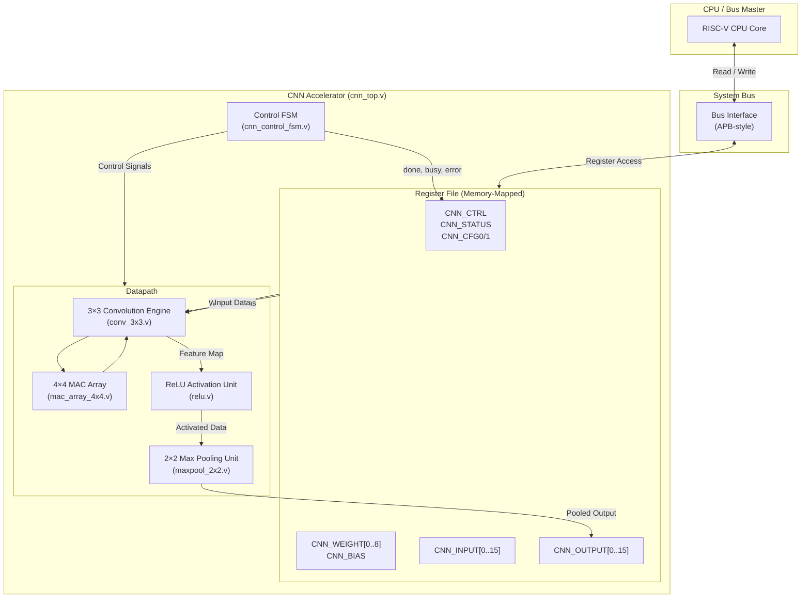
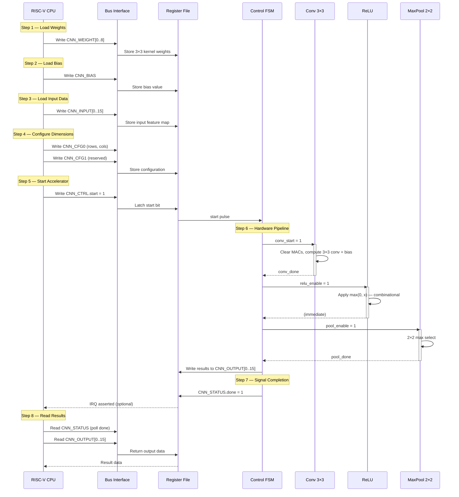
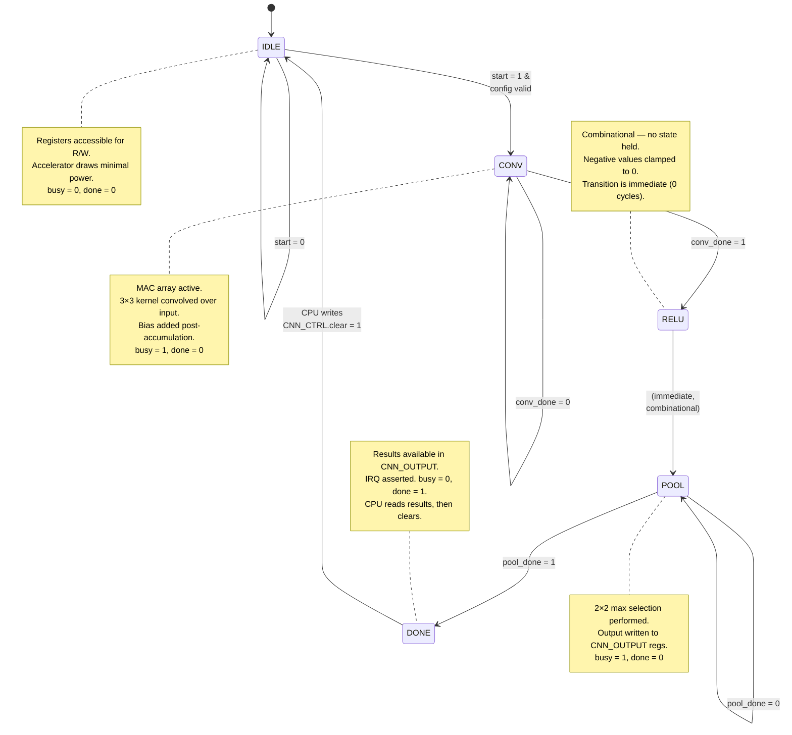

# CNN Accelerator — Architecture Documentation

**Project:** RISC-Shield SoC  
**Module:** Lightweight CNN Inference Accelerator  
**Path:** `rtl/accelerators/`  
**Version:** 1.0  
**Date:** 2026-07-11  

---

## Table of Contents

1. [Overview](#1-overview)
2. [Architecture Block Diagram](#2-architecture-block-diagram)
3. [Module Descriptions](#3-module-descriptions)
4. [Data Flow](#4-data-flow)
5. [FSM State Diagram](#5-fsm-state-diagram)
6. [Data Format](#6-data-format)
7. [Timing Analysis](#7-timing-analysis)
8. [Register Interface](#8-register-interface)
9. [Integration Notes](#9-integration-notes)
10. [Design Constraints and Trade-offs](#10-design-constraints-and-trade-offs)

---

## 1. Overview

The RISC-Shield SoC includes a **lightweight, fixed-function CNN inference accelerator** designed for edge AI workloads. It targets low-power, area-constrained deployments where a full neural network processor would be prohibitively expensive, but hardware-accelerated inference is required for real-time classification, anomaly detection, or sensor data processing.

### 1.1 Key Capabilities

| Feature                  | Specification                                    |
|--------------------------|--------------------------------------------------|
| **Convolution**          | 3×3 kernel, stride-1                             |
| **Activation Function**  | ReLU (Rectified Linear Unit)                     |
| **Pooling**              | 2×2 max pooling, stride-2                        |
| **Compute Core**         | 4×4 MAC (Multiply-Accumulate) array              |
| **Data Width**           | 32-bit (configurable via parameter)              |
| **Data Format**          | Q16.16 fixed-point or packed 8-bit integer       |
| **Bus Interface**        | Memory-mapped register access (32-bit APB-style) |
| **Programming Model**    | CPU-driven: load → start → poll → read           |

### 1.2 Design Philosophy

The accelerator is intentionally minimal. It accelerates the **innermost computational kernels** — convolution, activation, and pooling — while the CPU retains full control of data orchestration, layer sequencing, and memory management. This partitioning yields a small silicon footprint while still delivering meaningful speedup over pure-software inference.

### 1.3 Typical Use Cases

- **Keyword spotting** on audio spectrograms
- **Anomaly detection** on vibration / sensor time-series
- **Image classification** on small grayscale frames (e.g., 28×28 MNIST-class)
- **Wake-word detection** in always-on IoT endpoints

---

## 2. Architecture Block Diagram



### 2.1 Signal-Level Block Diagram (ASCII)

```
                    ┌──────────────────────────────────────────────────────────────────┐
                    │                     cnn_top.v                                    │
                    │                                                                  │
   ┌──────────┐    │  ┌──────────────────────┐    ┌──────────────────────────────┐    │
   │          │    │  │   Bus Interface       │    │   Control FSM                │    │
   │  System  │◄──►│  │                      │◄──►│   (cnn_control_fsm.v)        │    │
   │   Bus    │    │  │  addr[7:0]           │    │                              │    │
   │          │    │  │  wdata[31:0]         │    │  States:                     │    │
   └──────────┘    │  │  rdata[31:0]         │    │  IDLE→CONV→RELU→POOL→DONE   │    │
                    │  │  wen, ren, ready     │    │                              │    │
                    │  └──────────┬───────────┘    └──────┬───────────────────────┘    │
                    │             │                        │                            │
                    │             ▼                        │  ctrl signals              │
                    │  ┌──────────────────────┐            │                            │
                    │  │   Register File       │            │                            │
                    │  │                      │            │                            │
                    │  │  CNN_CTRL / STATUS   │◄───────────┘                            │
                    │  │  CNN_CFG0 / CFG1     │                                        │
                    │  │  CNN_WEIGHT[0..8]    │──────────┐                              │
                    │  │  CNN_BIAS            │──────────┤                              │
                    │  │  CNN_INPUT[0..15]    │──────┐   │                              │
                    │  │  CNN_OUTPUT[0..15]   │◄──┐  │   │                              │
                    │  └──────────────────────┘   │  │   │                              │
                    │                              │  │   │                              │
                    │                              │  ▼   ▼                              │
                    │                              │  ┌──────────────────────┐           │
                    │                              │  │  3×3 Convolution     │           │
                    │                              │  │  (conv_3x3.v)       │           │
                    │                              │  │                     │           │
                    │                              │  │  ┌───────────────┐  │           │
                    │                              │  │  │ 4×4 MAC Array │  │           │
                    │                              │  │  │(mac_array_4x4)│  │           │
                    │                              │  │  └───────────────┘  │           │
                    │                              │  └─────────┬──────────┘           │
                    │                              │            │                       │
                    │                              │            ▼                       │
                    │                              │  ┌──────────────────────┐           │
                    │                              │  │  ReLU Activation     │           │
                    │                              │  │  (relu.v)            │           │
                    │                              │  └─────────┬──────────┘           │
                    │                              │            │                       │
                    │                              │            ▼                       │
                    │                              │  ┌──────────────────────┐           │
                    │                              │  │  2×2 Max Pooling     │           │
                    │                              │  │  (maxpool_2x2.v)     │           │
                    │                              └──┤                      │           │
                    │                                 └──────────────────────┘           │
                    └──────────────────────────────────────────────────────────────────┘
```

---

## 3. Module Descriptions

### 3.1 `mac_unit.v` — Single Multiply-Accumulate Unit

The fundamental compute primitive of the accelerator.

| Property         | Detail                                         |
|------------------|-------------------------------------------------|
| **Function**     | Computes `accumulator += b × c` each clock cycle |
| **Data Width**   | Parameterized, default `DATA_WIDTH = 32`         |
| **Reset**        | Active-low asynchronous reset (`rst_n`)          |
| **Clear**        | Synchronous clear resets accumulator to zero      |

**Port List:**

| Port          | Direction | Width         | Description                           |
|---------------|-----------|---------------|---------------------------------------|
| `clk`         | Input     | 1             | System clock                          |
| `rst_n`       | Input     | 1             | Active-low asynchronous reset         |
| `clear`       | Input     | 1             | Synchronous clear (accumulator → 0)   |
| `enable`      | Input     | 1             | Accumulate enable                     |
| `a`           | Input     | `DATA_WIDTH`  | Multiplicand input                    |
| `b`           | Input     | `DATA_WIDTH`  | Multiplier input                      |
| `accumulator` | Output    | `2*DATA_WIDTH`| Accumulated result                    |

**Behavioral Description:**

```verilog
always @(posedge clk or negedge rst_n) begin
    if (!rst_n)
        accumulator <= 0;
    else if (clear)
        accumulator <= 0;
    else if (enable)
        accumulator <= accumulator + (a * b);
end
```

> [!NOTE]
> The accumulator is double-width (`2×DATA_WIDTH`) to prevent overflow during multi-cycle accumulation. When `DATA_WIDTH = 32`, the accumulator is 64 bits, supporting up to 2³² accumulations without overflow risk for typical weight/activation ranges.

---

### 3.2 `mac_array_4x4.v` — 4×4 MAC Array

A grid of 16 MAC units arranged in a 4×4 configuration for parallel multiply-accumulate operations.

| Property          | Detail                                        |
|-------------------|-----------------------------------------------|
| **Dimensions**    | 4 rows × 4 columns (16 MAC units total)       |
| **Throughput**    | 16 MACs per clock cycle                        |
| **Usage**         | Drives the 3×3 convolution engine              |

**Port List:**

| Port              | Direction | Width                | Description                           |
|-------------------|-----------|----------------------|---------------------------------------|
| `clk`             | Input     | 1                    | System clock                          |
| `rst_n`           | Input     | 1                    | Active-low reset                      |
| `clear`           | Input     | 1                    | Clear all accumulators                |
| `enable`          | Input     | 1                    | Global enable                         |
| `a[0:15]`         | Input     | 16 × `DATA_WIDTH`   | Multiplicand inputs (one per MAC)     |
| `b[0:15]`         | Input     | 16 × `DATA_WIDTH`   | Multiplier inputs (one per MAC)       |
| `result[0:15]`    | Output    | 16 × `2*DATA_WIDTH` | Accumulator outputs (one per MAC)     |

**Internal Structure:**

```
        Col 0       Col 1       Col 2       Col 3
      ┌─────────┬─────────┬─────────┬─────────┐
Row 0 │ MAC(0,0)│ MAC(0,1)│ MAC(0,2)│ MAC(0,3)│
      ├─────────┼─────────┼─────────┼─────────┤
Row 1 │ MAC(1,0)│ MAC(1,1)│ MAC(1,2)│ MAC(1,3)│
      ├─────────┼─────────┼─────────┼─────────┤
Row 2 │ MAC(2,0)│ MAC(2,1)│ MAC(2,2)│ MAC(2,3)│
      ├─────────┼─────────┼─────────┼─────────┤
Row 3 │ MAC(3,0)│ MAC(3,1)│ MAC(3,2)│ MAC(3,3)│
      └─────────┴─────────┴─────────┴─────────┘
```

For 3×3 convolution, only 9 of the 16 MACs are utilized (a 3×3 sub-grid), leaving 7 units idle. Future extensions could leverage the full array for larger kernels or batched operations.

---

### 3.3 `conv_3x3.v` — 3×3 Convolution Engine

Performs spatial convolution of a 3×3 kernel over the input feature map, producing an output feature map.

| Property           | Detail                                           |
|--------------------|--------------------------------------------------|
| **Kernel Size**    | 3×3 (9 weights)                                  |
| **Stride**         | 1 (fixed)                                        |
| **Padding**        | None (valid convolution)                         |
| **Bias**           | Added after accumulation                         |
| **Compute Method** | Dispatches to 4×4 MAC array (uses 3×3 sub-grid) |

**Port List:**

| Port            | Direction | Width          | Description                                  |
|-----------------|-----------|----------------|----------------------------------------------|
| `clk`           | Input     | 1              | System clock                                 |
| `rst_n`         | Input     | 1              | Active-low reset                             |
| `start`         | Input     | 1              | Begin convolution                            |
| `input_data`    | Input     | 16 × 32 bits   | Input feature map (from input registers)     |
| `weights`       | Input     | 9 × 32 bits    | 3×3 kernel weights (from weight registers)   |
| `bias`          | Input     | 32 bits        | Bias value                                   |
| `input_rows`    | Input     | 4 bits         | Number of input rows (from CNN_CFG0)         |
| `input_cols`    | Input     | 4 bits         | Number of input columns (from CNN_CFG0)      |
| `output_data`   | Output    | 16 × 32 bits   | Output feature map                           |
| `output_valid`  | Output    | 1              | Output data is valid                         |
| `busy`          | Output    | 1              | Convolution in progress                      |

**Operation:**

For an input of dimensions `H_in × W_in`, the output dimensions are:

```
H_out = H_in - 2
W_out = W_in - 2
```

At each output position `(r, c)`, the engine:

1. Clears the relevant MAC accumulators
2. Feeds the 3×3 input window and weights into the MAC array
3. Accumulates over one cycle (all 9 products computed in parallel)
4. Adds the bias to the accumulated result
5. Writes the result to the output position

> [!IMPORTANT]
> The minimum supported input dimension is 3×3 (producing a 1×1 output). The maximum input dimension supported by the register file is 4×4 (16 values), producing a 2×2 convolution output.

---

### 3.4 `relu.v` — ReLU Activation Unit

Applies the Rectified Linear Unit activation function.

| Property         | Detail                           |
|------------------|----------------------------------|
| **Function**     | `f(x) = max(0, x)`              |
| **Implementation** | Purely combinational          |
| **Latency**      | 0 cycles (combinational)        |
| **Data Width**   | Parameterized (default 32-bit)   |

**Port List:**

| Port       | Direction | Width        | Description                                         |
|------------|-----------|--------------|-----------------------------------------------------|
| `data_in`  | Input     | `DATA_WIDTH` | Signed input value                                  |
| `data_out` | Output    | `DATA_WIDTH` | Activated output: `0` if negative, `data_in` if ≥ 0 |

**Behavioral Description:**

```verilog
assign data_out = (data_in[DATA_WIDTH-1]) ? {DATA_WIDTH{1'b0}} : data_in;
```

The MSB is treated as the sign bit (two's complement). If the sign bit is `1` (negative value), the output is clamped to zero. Otherwise, the input passes through unchanged.

> [!TIP]
> ReLU is zero-cost in terms of clock cycles — it is implemented as a simple multiplexer gated on the sign bit. It can be placed directly in the datapath between convolution output and pooling input without pipeline stall.

---

### 3.5 `maxpool_2x2.v` — 2×2 Max Pooling Unit

Performs 2×2 spatial max pooling to downsample the feature map by a factor of 2 in each dimension.

| Property        | Detail                          |
|-----------------|----------------------------------|
| **Window**      | 2×2                              |
| **Stride**      | 2 (non-overlapping)              |
| **Function**    | Selects maximum of 4 input values |
| **Latency**     | 1 cycle (registered output)      |

**Port List:**

| Port           | Direction | Width          | Description                          |
|----------------|-----------|----------------|--------------------------------------|
| `clk`          | Input     | 1              | System clock                         |
| `rst_n`        | Input     | 1              | Active-low reset                     |
| `enable`       | Input     | 1              | Pooling enable                       |
| `data_in`      | Input     | 4 × 32 bits    | Four input values (2×2 window)       |
| `data_out`     | Output    | 32 bits        | Maximum of the four inputs           |
| `valid`        | Output    | 1              | Output is valid                      |

**Behavioral Description:**

```verilog
// Two-level comparison tree
wire [DATA_WIDTH-1:0] max_01 = ($signed(in0) > $signed(in1)) ? in0 : in1;
wire [DATA_WIDTH-1:0] max_23 = ($signed(in2) > $signed(in3)) ? in2 : in3;
wire [DATA_WIDTH-1:0] max_final = ($signed(max_01) > $signed(max_23)) ? max_01 : max_23;

always @(posedge clk or negedge rst_n) begin
    if (!rst_n)
        data_out <= 0;
    else if (enable)
        data_out <= max_final;
end
```

For a 2×2 convolution output, max pooling produces a single scalar value. For larger feature maps, the pooling unit is invoked iteratively by the control FSM for each 2×2 window.

**Output Dimensions:**

```
H_out = H_in / 2
W_out = W_in / 2
```

---

### 3.6 `cnn_control_fsm.v` — Control Finite State Machine

The central sequencer that orchestrates all datapath operations. It manages the pipeline of convolution → activation → pooling and provides status feedback to the CPU.

| Property         | Detail                                            |
|------------------|---------------------------------------------------|
| **States**       | IDLE, CONV, RELU, POOL, DONE                      |
| **Inputs**       | `start`, `conv_done`, `pool_done`                 |
| **Outputs**      | Control signals to all datapath modules + status   |
| **Error Handling** | Timeout watchdog, invalid configuration detection |

**Port List:**

| Port            | Direction | Width | Description                                   |
|-----------------|-----------|-------|-----------------------------------------------|
| `clk`           | Input     | 1     | System clock                                  |
| `rst_n`         | Input     | 1     | Active-low reset                              |
| `start`         | Input     | 1     | Start signal from CNN_CTRL register           |
| `input_rows`    | Input     | 4     | Configured input rows                         |
| `input_cols`    | Input     | 4     | Configured input columns                      |
| `conv_done`     | Input     | 1     | Convolution engine signals completion         |
| `pool_done`     | Input     | 1     | Pooling unit signals completion               |
| `conv_start`    | Output    | 1     | Trigger convolution                           |
| `relu_enable`   | Output    | 1     | Enable ReLU pass-through                      |
| `pool_enable`   | Output    | 1     | Enable pooling                                |
| `mac_clear`     | Output    | 1     | Clear MAC accumulators                        |
| `state`         | Output    | 3     | Current state (exposed via CNN_STATUS)        |
| `done`          | Output    | 1     | Operation complete                            |
| `busy`          | Output    | 1     | Accelerator is processing                     |
| `error`         | Output    | 1     | Error condition detected                      |

**State Descriptions:**

| State    | Encoding | Description                                                            |
|----------|----------|------------------------------------------------------------------------|
| `IDLE`   | 3'b000   | Awaiting `start`. Registers are CPU-accessible for read/write.         |
| `CONV`   | 3'b001   | MAC accumulators cleared, then 3×3 convolution is computed. Bias added.|
| `RELU`   | 3'b010   | ReLU applied to all convolution outputs (combinational, 0-cycle).      |
| `POOL`   | 3'b011   | 2×2 max pooling performed on activated feature map.                    |
| `DONE`   | 3'b100   | Results written to output registers. `done` flag asserted.             |

---

### 3.7 `cnn_top.v` — Top-Level Accelerator Module

The top-level wrapper that integrates the bus interface, register file, control FSM, and datapath into a single instantiable module.

**Port List:**

| Port           | Direction | Width | Description                          |
|----------------|-----------|-------|--------------------------------------|
| `clk`          | Input     | 1     | System clock                         |
| `rst_n`        | Input     | 1     | Active-low reset                     |
| `psel`         | Input     | 1     | Bus select                           |
| `penable`      | Input     | 1     | Bus enable                           |
| `pwrite`       | Input     | 1     | Write enable (1=write, 0=read)       |
| `paddr`        | Input     | 8     | Register address                     |
| `pwdata`       | Input     | 32    | Write data                           |
| `prdata`       | Output    | 32    | Read data                            |
| `pready`       | Output    | 1     | Transfer complete                    |
| `irq`          | Output    | 1     | Interrupt request (asserted on DONE) |

**Internal Instantiation Hierarchy:**

```
cnn_top
├── bus_interface (address decoding, register read/write)
├── register_file
│   ├── CNN_CTRL, CNN_STATUS, CNN_CFG0, CNN_CFG1
│   ├── CNN_WEIGHT[0..8], CNN_BIAS
│   ├── CNN_INPUT[0..15]
│   └── CNN_OUTPUT[0..15]
├── cnn_control_fsm
├── conv_3x3
│   └── mac_array_4x4
│       └── mac_unit (×16 instances)
├── relu
└── maxpool_2x2
```

---

## 4. Data Flow

The CNN accelerator follows a strict CPU-driven programming model. The CPU is responsible for loading data, triggering computation, and retrieving results.

### 4.1 Programming Sequence



### 4.2 Step-by-Step Detail

| Step | Action                         | Bus Transactions      | CNN State  | Notes                                         |
|------|--------------------------------|-----------------------|------------|-----------------------------------------------|
| 1    | Write 3×3 weights              | 9 writes              | IDLE       | Weights stored to `CNN_WEIGHT[0..8]`          |
| 2    | Write bias                     | 1 write               | IDLE       | Bias stored to `CNN_BIAS`                     |
| 3    | Write input feature map        | Up to 16 writes       | IDLE       | Data stored to `CNN_INPUT[0..15]`             |
| 4    | Write configuration            | 2 writes              | IDLE       | Dimensions in `CNN_CFG0`, options in `CNN_CFG1` |
| 5    | Set `CNN_CTRL.start = 1`       | 1 write               | IDLE→CONV  | Self-clearing start bit                       |
| 6    | Hardware pipeline executes     | —                     | CONV→RELU→POOL | CPU may poll `CNN_STATUS.busy`             |
| 7    | Done flag asserted             | —                     | DONE       | `CNN_STATUS.done = 1`, IRQ optional           |
| 8    | Read results                   | Up to 16 reads        | DONE       | Results in `CNN_OUTPUT[0..15]`                |

> [!WARNING]
> The input, weight, and configuration registers **must not be written** while the accelerator is busy (`CNN_STATUS.busy = 1`). Writes during active computation produce undefined results and may corrupt the output.

### 4.3 Data Transformation Example

For a 4×4 input with a 3×3 kernel:

```
Input (4×4):                  Kernel (3×3):         Bias:
┌────┬────┬────┬────┐        ┌────┬────┬────┐      ┌─────┐
│ I0 │ I1 │ I2 │ I3 │        │ W0 │ W1 │ W2 │      │  B  │
├────┼────┼────┼────┤        ├────┼────┼────┤      └─────┘
│ I4 │ I5 │ I6 │ I7 │        │ W3 │ W4 │ W5 │
├────┼────┼────┼────┤        ├────┼────┼────┤
│ I8 │ I9 │I10 │I11 │        │ W6 │ W7 │ W8 │
├────┼────┼────┼────┤        └────┴────┴────┘
│I12 │I13 │I14 │I15 │
└────┴────┴────┴────┘

After Convolution (2×2):      After ReLU (2×2):      After MaxPool (1×1):
┌──────┬──────┐              ┌──────┬──────┐         ┌──────┐
│  C0  │  C1  │              │  R0  │  R1  │         │  P0  │
├──────┼──────┤              ├──────┼──────┤         └──────┘
│  C2  │  C3  │              │  R2  │  R3  │
└──────┴──────┘              └──────┴──────┘

Where:
  C0 = Σ(I[r+i][c+j] × W[i][j]) + B,  for (r,c)=(0,0), i,j ∈ {0,1,2}
  R0 = max(0, C0)
  P0 = max(R0, R1, R2, R3)
```

---

## 5. FSM State Diagram



### 5.1 State Transition Table

| Current State | Condition                 | Next State | Actions                                        |
|---------------|---------------------------|------------|-------------------------------------------------|
| `IDLE`        | `start = 1`, config valid | `CONV`     | Assert `mac_clear`, then `conv_start`           |
| `IDLE`        | `start = 0`               | `IDLE`     | No action                                       |
| `IDLE`        | `start = 1`, config invalid | `IDLE`   | Assert `error` flag in CNN_STATUS               |
| `CONV`        | `conv_done = 1`           | `RELU`     | Route conv output through ReLU                  |
| `CONV`        | `conv_done = 0`           | `CONV`     | Continue MAC accumulation                       |
| `RELU`        | Always (combinational)    | `POOL`     | Assert `pool_enable`                            |
| `POOL`        | `pool_done = 1`           | `DONE`     | Write results to output registers               |
| `POOL`        | `pool_done = 0`           | `POOL`     | Continue max comparisons                        |
| `DONE`        | `CNN_CTRL.clear = 1`      | `IDLE`     | De-assert `done`, clear output valid            |

> [!NOTE]
> The RELU state has **zero latency** because it is purely combinational. In the hardware implementation, RELU→POOL may collapse into a single clock cycle, depending on the FSM encoding. The state is logically distinct but may be physically merged with the POOL entry transition.

---

## 6. Data Format

The CNN accelerator supports two data representation modes, selected via the `CNN_CFG1.data_fmt` field.

### 6.1 Q16.16 Fixed-Point Format (Default)

Each 32-bit register holds a single fixed-point value in **Q16.16** format:

```
Bit Layout (32 bits):
┌──────────────────────────────┬───────────────────────────────┐
│  31  30  ...  17  16        │  15  14  ...   1   0          │
│  ◄── Integer Part (16b) ──► │  ◄── Fractional Part (16b) ──►│
│         (signed)             │                                │
└──────────────────────────────┴───────────────────────────────┘

Bit 31:       Sign bit (two's complement)
Bits [30:16]: Integer magnitude (15 bits)
Bits [15:0]:  Fractional part (16 bits, resolution = 2⁻¹⁶ ≈ 1.53 × 10⁻⁵)
```

| Property            | Value                                    |
|---------------------|------------------------------------------|
| **Range**           | −32768.0 to +32767.999984741             |
| **Resolution**      | 2⁻¹⁶ ≈ 0.0000153                        |
| **Representation**  | `value = register_value / 65536`         |
| **Example**         | `0x00018000` = 1.5, `0xFFFF0000` = −1.0  |

**Conversion Formulas:**

```c
// C code for CPU-side conversion
int32_t float_to_q16(float val) { return (int32_t)(val * 65536.0f); }
float   q16_to_float(int32_t q) { return (float)q / 65536.0f; }
```

### 6.2 Packed 8-bit Integer Format (Alternate)

Four 8-bit signed integer values are packed into each 32-bit register word, increasing throughput for quantized models:

```
Bit Layout (32 bits):
┌──────────┬──────────┬──────────┬──────────┐
│ Byte 3   │ Byte 2   │ Byte 1   │ Byte 0   │
│ [31:24]  │ [23:16]  │ [15:8]   │ [7:0]    │
│ Val 3    │ Val 2    │ Val 1    │ Val 0    │
└──────────┴──────────┴──────────┴──────────┘

Each byte: signed 8-bit integer (range: −128 to +127)
```

| Property            | Value                         |
|---------------------|-------------------------------|
| **Range per value** | −128 to +127                  |
| **Values per word** | 4                             |
| **Total values**    | 64 (16 registers × 4 values) |
| **Use case**        | INT8 quantized neural networks |

> [!IMPORTANT]
> In packed 8-bit mode, the MAC units operate on byte-wide slices. The internal accumulator still uses full 32-bit precision to avoid intermediate overflow during convolution. The final output is saturated back to 8-bit range before writing to output registers.

### 6.3 Format Comparison

| Aspect              | Q16.16 Fixed-Point      | Packed INT8              |
|---------------------|-------------------------|--------------------------|
| **Precision**       | High (16-bit fractional) | Low (integer only)       |
| **Values/Register** | 1                        | 4                        |
| **Feature Map Size**| Up to 4×4 = 16 values   | Up to 8×8 = 64 values   |
| **Model Support**   | Float-trained models     | Quantization-aware models|
| **Accuracy**        | Higher                   | Lower (post-quantization)|
| **Throughput**       | 1×                      | 4× (for same cycle count)|

---

## 7. Timing Analysis

### 7.1 Cycle-by-Cycle Breakdown

The following analysis assumes a 4×4 input feature map with a 3×3 kernel (producing a 2×2 convolution output, then a 1×1 pooled output).

| Phase                | Clock Cycles | Description                                                 |
|----------------------|--------------|-------------------------------------------------------------|
| **Register Load**    | 28           | CPU bus writes: 9 weights + 1 bias + 16 inputs + 2 config  |
| **Start**            | 1            | CPU writes `CNN_CTRL.start`                                 |
| **MAC Clear**        | 1            | Accumulators zeroed                                         |
| **Convolution**      | 4–5          | 4 output positions, 1 cycle each (9 parallel MACs) + pipeline |
| **ReLU**             | 0            | Combinational (zero latency, merged with pipeline register)  |
| **Max Pooling**      | 1            | Single 2×2 window comparison + register                     |
| **Result Writeback** | 1            | Output values written to CNN_OUTPUT registers                |
| **Done → CPU Read**  | 1–16         | CPU reads 1 to 16 output registers                          |
| **Total (HW only)**  | **7–8**      | From `start` to `done` assertion                            |
| **Total (with I/O)** | **36–46**    | Including CPU register load and result readback              |

### 7.2 Throughput Estimates

| Input Size | Conv Output | Pool Output | HW Cycles | Effective MACs/cycle |
|------------|-------------|-------------|-----------|---------------------|
| 3×3        | 1×1         | N/A*        | ~3        | 3.0                 |
| 4×4        | 2×2         | 1×1         | ~8        | 4.5                 |

_*Pooling requires minimum 2×2 input; a 1×1 conv output bypasses pooling._

### 7.3 Clock Frequency Target

| Parameter               | Value         |
|--------------------------|---------------|
| **Target Frequency**     | 50 MHz        |
| **Critical Path**        | MAC multiply + accumulate (1 cycle) |
| **HW Latency (4×4 in)** | ~8 cycles = 160 ns @ 50 MHz |
| **SW Baseline (est.)**   | ~500+ cycles = 10 µs @ 50 MHz |
| **Speedup**              | ~60× (compute only, excluding I/O) |

> [!TIP]
> For multi-layer inference, the CPU should double-buffer: while the accelerator processes one tile, the CPU prepares the next tile's weights and inputs in a shadow register bank. This hides the I/O latency and keeps the MAC array utilized.

### 7.4 Pipeline Timing Diagram

```
Clock  │  1  │  2  │  3  │  4  │  5  │  6  │  7  │  8  │
───────┼─────┼─────┼─────┼─────┼─────┼─────┼─────┼─────┤
FSM    │IDLE │CONV │CONV │CONV │CONV │CONV │RELU │POOL │DONE
       │     │     │     │     │     │     │+POOL│     │
MAC    │CLR  │ C0  │ C1  │ C2  │ C3  │BIAS │     │     │
ReLU   │     │     │     │     │     │     │ ✓   │     │
Pool   │     │     │     │     │     │     │     │ ✓   │
Output │     │     │     │     │     │     │     │     │ ✓

C0–C3: Computing convolution output positions 0 through 3
CLR:   MAC accumulator clear
BIAS:  Bias addition to accumulated results
✓:     Operation active in this cycle
```

---

## 8. Register Interface

The CNN accelerator occupies a contiguous block in the SoC memory map. All registers are 32 bits wide and aligned to 4-byte boundaries.

### 8.1 Register Map Summary

| Offset  | Name             | R/W  | Description                              |
|---------|------------------|------|------------------------------------------|
| `0x00`  | `CNN_CTRL`       | R/W  | Control register (start, clear, config)  |
| `0x04`  | `CNN_STATUS`     | R    | Status register (done, busy, error, state)|
| `0x08`  | `CNN_CFG0`       | R/W  | Input dimensions (rows, cols)            |
| `0x0C`  | `CNN_CFG1`       | R/W  | Data format, options, reserved           |
| `0x10`  | `CNN_BIAS`       | R/W  | Bias value for convolution               |
| `0x14–0x34` | `CNN_WEIGHT[0..8]` | R/W | 3×3 kernel weights (9 registers)     |
| `0x40–0x7C` | `CNN_INPUT[0..15]` | R/W | Input feature map data (16 registers)|
| `0x80–0xBC` | `CNN_OUTPUT[0..15]`| R   | Output results (16 registers)        |

### 8.2 Register Bit Fields

#### `CNN_CTRL` (Offset `0x00`)

| Bits   | Name       | Access | Reset | Description                                    |
|--------|------------|--------|-------|------------------------------------------------|
| [0]    | `start`    | R/W1S  | 0     | Write `1` to begin processing. Self-clearing.  |
| [1]    | `clear`    | R/W1S  | 0     | Write `1` to clear done status and return to IDLE. |
| [2]    | `irq_en`   | R/W    | 0     | `1` = enable interrupt on completion.          |
| [31:3] | Reserved   | R      | 0     | Reserved. Reads as zero.                       |

#### `CNN_STATUS` (Offset `0x04`)

| Bits   | Name       | Access | Reset | Description                                    |
|--------|------------|--------|-------|------------------------------------------------|
| [0]    | `done`     | R      | 0     | `1` = processing complete, results available.  |
| [1]    | `busy`     | R      | 0     | `1` = accelerator is processing.               |
| [2]    | `error`    | R      | 0     | `1` = error detected (invalid config).         |
| [5:3]  | `state`    | R      | 0     | Current FSM state encoding.                    |
| [31:6] | Reserved   | R      | 0     | Reserved.                                      |

#### `CNN_CFG0` (Offset `0x08`)

| Bits    | Name         | Access | Reset | Description                          |
|---------|--------------|--------|-------|--------------------------------------|
| [3:0]   | `input_rows` | R/W    | 4     | Number of input rows (1–4)           |
| [7:4]   | `input_cols` | R/W    | 4     | Number of input columns (1–4)        |
| [31:8]  | Reserved     | R      | 0     | Reserved.                            |

#### `CNN_CFG1` (Offset `0x0C`)

| Bits    | Name         | Access | Reset | Description                          |
|---------|--------------|--------|-------|--------------------------------------|
| [0]     | `data_fmt`   | R/W    | 0     | `0` = Q16.16, `1` = Packed INT8     |
| [1]     | `pool_bypass` | R/W   | 0     | `1` = skip max pooling stage         |
| [31:2]  | Reserved     | R      | 0     | Reserved.                            |

### 8.3 Register Access Rules

> [!CAUTION]
> **Critical access constraints:**
> - `CNN_WEIGHT`, `CNN_INPUT`, `CNN_BIAS`, `CNN_CFG0`, and `CNN_CFG1` **must only be written when** `CNN_STATUS.busy = 0`.
> - `CNN_OUTPUT` registers contain **valid data only when** `CNN_STATUS.done = 1`.
> - Writing to `CNN_OUTPUT` addresses has **no effect** (read-only registers).
> - The `start` bit is **self-clearing**: hardware resets it to `0` after latching the start pulse.
> - Writing `CNN_CTRL.clear = 1` while `busy = 1` is **ignored**.

### 8.4 Typical CPU Driver Code

```c
#include <stdint.h>

#define CNN_BASE       0x50000000  // See SoC memory map document

#define CNN_CTRL       (*(volatile uint32_t *)(CNN_BASE + 0x00))
#define CNN_STATUS     (*(volatile uint32_t *)(CNN_BASE + 0x04))
#define CNN_CFG0       (*(volatile uint32_t *)(CNN_BASE + 0x08))
#define CNN_CFG1       (*(volatile uint32_t *)(CNN_BASE + 0x0C))
#define CNN_BIAS       (*(volatile uint32_t *)(CNN_BASE + 0x10))
#define CNN_WEIGHT(i)  (*(volatile uint32_t *)(CNN_BASE + 0x14 + (i)*4))
#define CNN_INPUT(i)   (*(volatile uint32_t *)(CNN_BASE + 0x40 + (i)*4))
#define CNN_OUTPUT(i)  (*(volatile uint32_t *)(CNN_BASE + 0x80 + (i)*4))

void cnn_run_layer(const int32_t weights[9], int32_t bias,
                   const int32_t input[16], int32_t output[16],
                   uint8_t rows, uint8_t cols)
{
    // Step 1: Load weights
    for (int i = 0; i < 9; i++)
        CNN_WEIGHT(i) = weights[i];

    // Step 2: Load bias
    CNN_BIAS = bias;

    // Step 3: Load input data
    for (int i = 0; i < (rows * cols); i++)
        CNN_INPUT(i) = input[i];

    // Step 4: Configure dimensions
    CNN_CFG0 = ((cols & 0xF) << 4) | (rows & 0xF);
    CNN_CFG1 = 0x00;  // Q16.16, pooling enabled

    // Step 5: Start accelerator
    CNN_CTRL = 0x01;

    // Step 6–7: Poll for completion
    while (!(CNN_STATUS & 0x01))
        ;  // Spin on done bit

    // Step 8: Read results
    uint8_t out_rows = (rows - 2) / 2;
    uint8_t out_cols = (cols - 2) / 2;
    for (int i = 0; i < (out_rows * out_cols); i++)
        output[i] = CNN_OUTPUT(i);

    // Clear done flag
    CNN_CTRL = 0x02;
}
```

> [!NOTE]
> For the complete SoC memory map including the CNN accelerator base address and all peripheral address ranges, refer to the **Memory Map** documentation (`docs/memory_map.md`).

---

## 9. Integration Notes

### 9.1 SoC Interconnect

The CNN accelerator connects to the RISC-V CPU via the system bus fabric. It appears as a slave peripheral in the memory-mapped I/O region.

```
┌──────────┐     ┌──────────────┐     ┌─────────────────┐
│ RISC-V   │────►│  System Bus  │────►│ CNN Accelerator  │
│ CPU Core │     │  (Arbiter)   │────►│ AES Engine       │
│          │◄────│              │────►│ GPIO / UART      │
└──────────┘     └──────────────┘     │ Timer / Memory   │
                                       └─────────────────┘
```

### 9.2 Interrupt Handling

When `CNN_CTRL.irq_en = 1`, the `irq` output is asserted when the FSM enters the `DONE` state. This allows the CPU to perform other work while the accelerator processes, instead of polling `CNN_STATUS.done`.

**Interrupt Service Routine (ISR) skeleton:**

```c
void cnn_isr(void) {
    if (CNN_STATUS & 0x01) {        // done flag
        read_cnn_results();          // Read CNN_OUTPUT registers
        CNN_CTRL = 0x02;             // Clear done, return to IDLE
        signal_inference_complete(); // Notify application
    }
}
```

### 9.3 Clock and Reset

| Signal   | Source                   | Notes                                |
|----------|--------------------------|--------------------------------------|
| `clk`    | System clock (50 MHz)    | Synchronous to bus clock domain      |
| `rst_n`  | System reset controller  | Active-low, asynchronous assert, synchronous de-assert |

### 9.4 Power Considerations

- In `IDLE` state, the MAC array is clock-gated (if supported by the synthesis tool) to minimize dynamic power
- The `clear` signal can be used to zero out registers when not in use, reducing leakage in data-dependent power profiles
- Estimated area: ~5K–8K gates (depending on technology node and data width)

---

## 10. Design Constraints and Trade-offs

### 10.1 Limitations

| Limitation                       | Rationale                                                   |
|----------------------------------|-------------------------------------------------------------|
| **Fixed 3×3 kernel only**        | Simplifies datapath; 3×3 is the most common kernel size     |
| **Max 4×4 input per invocation** | Register file depth limited to 16 for area savings          |
| **No stride configurability**    | Stride-1 conv + stride-2 pool covers most edge AI use cases |
| **No padding support**           | CPU can zero-pad inputs in software before loading          |
| **Single channel / single filter** | Multi-channel handled by iterating in software           |
| **No DMA support**               | CPU must manually load/unload registers via bus              |

### 10.2 Future Extensions

| Feature                        | Complexity  | Benefit                                    |
|--------------------------------|-------------|--------------------------------------------|
| **DMA support**                | Medium      | Eliminate CPU overhead for data transfer    |
| **Deeper register file**       | Low         | Support larger input feature maps           |
| **5×5 / 7×7 kernels**         | Medium      | Broader model compatibility                |
| **Multi-channel support**      | High        | Accelerate depth-wise convolutions         |
| **Average pooling option**     | Low         | Support additional pooling modes           |
| **Batch normalization**        | Medium      | Fuse BN into the pipeline                  |
| **Shadow register bank**       | Low–Medium  | Enable double-buffering for pipelined I/O  |

### 10.3 Verification Checklist

- [ ] MAC unit: verify accumulate, clear, overflow behavior
- [ ] MAC array: verify all 16 units operate independently
- [ ] Conv 3×3: validate against software golden model for all valid input sizes
- [ ] ReLU: verify positive pass-through and negative clamping (boundary: 0, −1, INT_MIN)
- [ ] MaxPool: verify correct max selection for all tie-breaking cases
- [ ] FSM: verify all state transitions, including illegal start during busy
- [ ] Register access: verify read/write behavior, read-only enforcement, self-clearing bits
- [ ] End-to-end: load→compute→read for known test vectors
- [ ] Interrupt: verify IRQ assertion/de-assertion timing
- [ ] Error handling: invalid configuration dimensions, start-while-busy

---

## Appendix A: Module File Listing

| File                  | Path                              | Description                         |
|-----------------------|-----------------------------------|-------------------------------------|
| `mac_unit.v`          | `rtl/accelerators/mac_unit.v`     | Single multiply-accumulate unit     |
| `mac_array_4x4.v`    | `rtl/accelerators/mac_array_4x4.v`| 4×4 MAC array                      |
| `conv_3x3.v`         | `rtl/accelerators/conv_3x3.v`    | 3×3 convolution engine             |
| `relu.v`             | `rtl/accelerators/relu.v`        | ReLU activation (combinational)    |
| `maxpool_2x2.v`      | `rtl/accelerators/maxpool_2x2.v` | 2×2 max pooling unit               |
| `cnn_control_fsm.v`  | `rtl/accelerators/cnn_control_fsm.v` | Control state machine          |
| `cnn_top.v`          | `rtl/accelerators/cnn_top.v`     | Top-level accelerator wrapper      |

## Appendix B: Glossary

| Term        | Definition                                                                 |
|-------------|----------------------------------------------------------------------------|
| **MAC**     | Multiply-Accumulate: `acc += a × b`                                       |
| **ReLU**    | Rectified Linear Unit: `f(x) = max(0, x)`                                 |
| **Q16.16**  | Fixed-point format with 16 integer bits and 16 fractional bits             |
| **INT8**    | 8-bit signed integer (range −128 to +127)                                 |
| **Stride**  | Step size when sliding the convolution kernel over the input               |
| **Pooling** | Downsampling operation that reduces spatial dimensions                     |
| **FSM**     | Finite State Machine                                                       |
| **APB**     | Advanced Peripheral Bus (AMBA protocol family)                             |
| **IRQ**     | Interrupt Request                                                          |
| **DMA**     | Direct Memory Access                                                       |

---

*This document is part of the RISC-Shield SoC hardware architecture documentation suite.*
