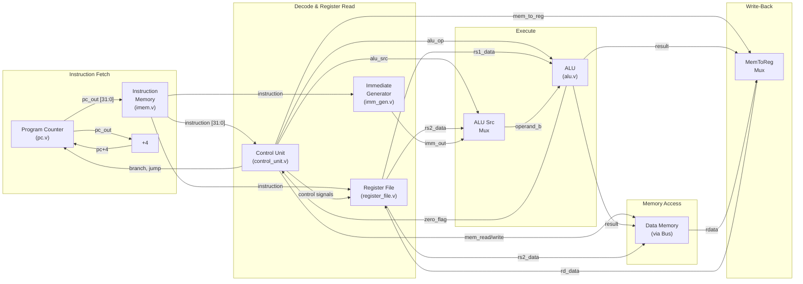

# RV32I Single-Cycle Processor — Architecture Specification

> **Project:** RISC-Shield SoC  
> **Module Path:** `rtl/cpu/`  
> **ISA:** RISC-V RV32I (Integer Base, 32-bit)  
> **Microarchitecture:** Single-Cycle  
> **Version:** 1.0  

---

## Table of Contents

1. [Overview](#1-overview)
2. [Supported Instructions](#2-supported-instructions)
3. [Microarchitecture Block Diagram](#3-microarchitecture-block-diagram)
4. [Module Descriptions](#4-module-descriptions)
   - 4.1 [Program Counter — `pc.v`](#41-program-counter--pcv)
   - 4.2 [Instruction Memory Interface — `imem.v`](#42-instruction-memory-interface--imemv)
   - 4.3 [Register File — `register_file.v`](#43-register-file--register_filev)
   - 4.4 [ALU — `alu.v`](#44-alu--aluv)
   - 4.5 [Immediate Generator — `imm_gen.v`](#45-immediate-generator--imm_genv)
   - 4.6 [Control Unit — `control_unit.v`](#46-control-unit--control_unitv)
   - 4.7 [Datapath — `datapath.v`](#47-datapath--datapathv)
5. [Control Signal Truth Table](#5-control-signal-truth-table)
6. [ALU Operation Encoding](#6-alu-operation-encoding)
7. [Instruction Execution Flow](#7-instruction-execution-flow)
8. [Bus Interface](#8-bus-interface)

---

## 1. Overview

The RISC-Shield SoC integrates a **custom single-cycle RV32I processor** as its central processing element. The processor implements the RISC-V 32-bit Integer base instruction set and is designed with simplicity and educational clarity as primary goals.

### Key Design Characteristics

| Parameter                | Value                          |
|--------------------------|--------------------------------|
| ISA                      | RISC-V RV32I (Base Integer)    |
| Data Width               | 32 bits                        |
| Address Width            | 32 bits                        |
| Pipeline Stages          | **1 (single-cycle)**           |
| Hazard Detection         | None (not required)            |
| Data Forwarding          | None (not required)            |
| Instruction Cache        | None                           |
| Data Cache               | None                           |
| Branch Prediction        | None                           |
| Register Count           | 32 general-purpose (x0–x31)   |
| Endianness               | Little-endian                  |

### Design Philosophy

The processor executes **one complete instruction per clock cycle**. Every phase of instruction execution — fetch, decode, execute, memory access, and write-back — occurs combinationally within a single clock period. The only sequential element that advances state is the **Program Counter (PC)** register, which is updated on the rising edge of the clock.

Because the entire instruction completes in one cycle, there are:

- **No pipeline hazards** — there is no pipeline to create data or control dependencies.
- **No forwarding paths** — results are written back before the next instruction reads them.
- **No cache hierarchy** — instruction and data memories are accessed directly with single-cycle latency.

The clock period is constrained by the **longest combinational critical path**, which is typically the load-word (`LW`) instruction path: PC → Instruction Memory → Register File Read → ALU → Data Memory Read → Register File Write-Back.

---

## 2. Supported Instructions

The processor supports a subset of the RV32I base integer instruction set, comprising **11 instructions** across five encoding formats.

### 2.1 Instruction Summary

| Instruction | Format | Operation                                  | Assembly Syntax          |
|-------------|--------|--------------------------------------------|--------------------------|
| `ADD`       | R-type | `rd = rs1 + rs2`                           | `add  rd, rs1, rs2`      |
| `SUB`       | R-type | `rd = rs1 - rs2`                           | `sub  rd, rs1, rs2`      |
| `AND`       | R-type | `rd = rs1 & rs2`                           | `and  rd, rs1, rs2`      |
| `OR`        | R-type | `rd = rs1 \| rs2`                          | `or   rd, rs1, rs2`      |
| `XOR`       | R-type | `rd = rs1 ^ rs2`                           | `xor  rd, rs1, rs2`      |
| `SLT`       | R-type | `rd = (rs1 < rs2) ? 1 : 0` (signed)       | `slt  rd, rs1, rs2`      |
| `ADDI`      | I-type | `rd = rs1 + imm[11:0]` (sign-extended)     | `addi rd, rs1, imm`      |
| `LW`        | I-type | `rd = Mem[rs1 + imm[11:0]]`               | `lw   rd, imm(rs1)`      |
| `SW`        | S-type | `Mem[rs1 + imm[11:0]] = rs2`              | `sw   rs2, imm(rs1)`     |
| `BEQ`       | B-type | `if (rs1 == rs2) PC += imm`               | `beq  rs1, rs2, offset`  |
| `JAL`       | J-type | `rd = PC + 4; PC += imm`                  | `jal  rd, offset`        |

### 2.2 RISC-V Encoding Formats

The RISC-V ISA uses a fixed 32-bit instruction width with a regular encoding structure. The lowest two bits are always `11` for 32-bit instructions.

```
R-type:  [  funct7  | rs2 | rs1 | funct3 |  rd  | opcode ]
          31     25  24 20 19 15  14   12  11   7   6    0

I-type:  [    imm[11:0]   | rs1 | funct3 |  rd  | opcode ]
          31            20 19 15  14   12  11   7   6    0

S-type:  [ imm[11:5] | rs2 | rs1 | funct3 | imm[4:0] | opcode ]
          31       25 24 20 19 15  14   12   11     7    6    0

B-type:  [ imm[12|10:5] | rs2 | rs1 | funct3 | imm[4:1|11] | opcode ]
          31           25 24 20 19 15  14   12   11        7    6    0

J-type:  [       imm[20|10:1|11|19:12]       |  rd  | opcode ]
          31                                12  11  7   6    0
```

### 2.3 Full Encoding Table

| Instruction | Opcode (`[6:0]`) | funct3 (`[14:12]`) | funct7 (`[31:25]`) | Format |
|-------------|:-----------------:|:------------------:|:------------------:|:------:|
| `ADD`       | `0110011`         | `000`              | `0000000`          | R      |
| `SUB`       | `0110011`         | `000`              | `0100000`          | R      |
| `AND`       | `0110011`         | `111`              | `0000000`          | R      |
| `OR`        | `0110011`         | `110`              | `0000000`          | R      |
| `XOR`       | `0110011`         | `100`              | `0000000`          | R      |
| `SLT`       | `0110011`         | `010`              | `0000000`          | R      |
| `ADDI`      | `0010011`         | `000`              | —                  | I      |
| `LW`        | `0000011`         | `010`              | —                  | I      |
| `SW`        | `0100011`         | `010`              | —                  | S      |
| `BEQ`       | `1100011`         | `000`              | —                  | B      |
| `JAL`       | `1101111`         | —                  | —                  | J      |

> **Note:** The `funct7` field is only present in R-type instructions. For `ADD` vs. `SUB` disambiguation, bit `[30]` of the instruction word serves as the differentiator (`0` for `ADD`, `1` for `SUB`).

---

## 3. Microarchitecture Block Diagram

### 3.1 Datapath Diagram (Mermaid)



### 3.2 Datapath Diagram (ASCII Art)

For environments where Mermaid rendering is unavailable:

```
                                    ┌──────────────────────────────────────────────────────────────┐
                                    │                    Control Unit (control_unit.v)              │
                                    │  Inputs: instruction[31:0], zero_flag                        │
                                    │  Outputs: reg_write, mem_read, mem_write, mem_to_reg,        │
                                    │           alu_src, branch, jump, alu_op[3:0]                 │
                                    └──┬────┬────┬────┬────┬────┬────┬────┬─────────────────────────┘
                                       │    │    │    │    │    │    │    │
         ┌─────────────────────────────┼────┼────┼────┼────┼────┼────┼────┼──────────────────────┐
         │                             │    │    │    │    │    │    │    │                       │
         ▼                             ▼    │    ▼    │    ▼    │    ▼    │                       │
    ┌─────────┐    ┌───────────┐   ┌──────────────┐  │  ┌───┐  │  ┌──────────┐   ┌──────────┐  │
    │         │    │           │   │              │  │  │MUX│  │  │          │   │          │  │
    │   PC    │───▶│   IMEM    │──▶│  Register    │──┼─▶│   │──┼─▶│   ALU    │──▶│   Data   │  │
    │ (pc.v)  │    │ (imem.v)  │   │    File      │  │  │A/B│  │  │ (alu.v)  │   │  Memory  │  │
    │         │    │           │   │(register_file │  │  │   │  │  │          │   │ (via Bus)│  │
    └────┬────┘    └─────┬─────┘   │     .v)      │  │  └─┬─┘  │  └────┬─────┘   └────┬─────┘  │
         │               │        └──────────────┘  │    │     │       │              │        │
         │               │               │          │    │     │       │              │        │
         │               ▼               │          │    ▲     │       │              ▼        │
         │        ┌─────────────┐        │          │    │     │       │         ┌─────────┐   │
         │        │  Immediate  │        │          │    │     │       │         │  WB Mux │   │
         │        │  Generator  │────────┼──────────┼────┘     │       └────────▶│mem_to_reg│──┘
         │        │ (imm_gen.v) │        │          │          │                 └────┬────┘
         │        └─────────────┘        │          │          │                      │
         │                               │          │          │                      │
         │                               └──────────┼──────────┼──────────────────────┘
         │                                          │          │          rd_data (write-back)
         │              ┌───┐                       │          │
         └──────────────┤+4 ├───────────────────────┘          │
          pc_next       └───┘   (also branch/jump target)      │
              ▲                                                │
              └────────────────────────────────────────────────┘
                          (branch/jump target from ALU/ImmGen)
```

---

## 4. Module Descriptions

All CPU modules reside under `rtl/cpu/`. Each module is described below with its purpose, interface, and internal behavior.

---

### 4.1 Program Counter — `pc.v`

**Purpose:** The Program Counter is a 32-bit sequential register that holds the address of the currently executing instruction. On each rising clock edge it latches the next PC value, which is either `PC + 4` (sequential execution), a branch target, or a jump target.

**Interface:**

| Port       | Direction | Width   | Description                                      |
|------------|-----------|---------|--------------------------------------------------|
| `clk`      | Input     | 1 bit   | System clock                                     |
| `rst_n`    | Input     | 1 bit   | Active-low asynchronous reset                    |
| `pc_next`  | Input     | 32 bits | Next PC value (PC+4, branch target, or jump target) |
| `pc_out`   | Output    | 32 bits | Current PC value driven to instruction memory    |

**Behavior:**

```verilog
always @(posedge clk or negedge rst_n) begin
    if (!rst_n)
        pc_out <= 32'h0000_0000;    // Reset vector: address 0x0
    else
        pc_out <= pc_next;
end
```

**Design Notes:**
- The reset vector is `0x0000_0000`. On assertion of `rst_n` (active-low), the PC is driven to the base of instruction memory.
- The `pc_next` value is computed combinationally in the datapath as:
  - **Sequential:** `pc_out + 4`
  - **Branch (BEQ taken):** `pc_out + imm_out` (when `branch & zero_flag`)
  - **Jump (JAL):** `pc_out + imm_out`
- The PC always advances on every clock edge — there is no stall mechanism in the single-cycle design.

---

### 4.2 Instruction Memory Interface — `imem.v`

**Purpose:** The instruction memory provides the 32-bit instruction word corresponding to the address presented by the Program Counter. It behaves as a **read-only, combinational (asynchronous read) memory** — the instruction is available in the same cycle the address is presented.

**Interface:**

| Port          | Direction | Width   | Description                                    |
|---------------|-----------|---------|------------------------------------------------|
| `addr`        | Input     | 32 bits | Byte address from the Program Counter          |
| `instruction` | Output    | 32 bits | 32-bit instruction word at the given address   |

**Parameters:**

| Parameter  | Default | Description                                |
|------------|--------:|--------------------------------------------|
| `DEPTH`    | 256     | Number of 32-bit words in instruction memory |

**Behavior:**

```verilog
reg [31:0] mem [0:DEPTH-1];     // Word-addressable storage

assign instruction = mem[addr[31:2]];   // Word-aligned access (drop lower 2 bits)
```

**Design Notes:**
- The memory is **word-addressed internally**: the lower two bits of `addr` are discarded, and `addr[31:2]` is used as the word index. This is consistent with the RISC-V specification that instructions are naturally aligned to 4-byte boundaries.
- Contents are loaded at elaboration time using `$readmemh()` or `$readmemb()` from a hex file, enabling easy program loading for simulation.
- In synthesis, this module maps to a ROM or block RAM initialized with the firmware image.
- The parameterized `DEPTH` allows scaling memory capacity. A depth of 256 provides 1 KB of instruction storage (256 × 4 bytes).

---

### 4.3 Register File — `register_file.v`

**Purpose:** The register file provides the 32 general-purpose registers defined by the RISC-V ISA (`x0`–`x31`). It supports **two simultaneous asynchronous reads** and **one synchronous write** per clock cycle, matching the single-cycle datapath's requirement to read two source operands and write one destination result within the same cycle.

**Interface:**

| Port        | Direction | Width   | Description                                      |
|-------------|-----------|---------|--------------------------------------------------|
| `clk`       | Input     | 1 bit   | System clock                                     |
| `rs1_addr`  | Input     | 5 bits  | Read port 1 — source register 1 address          |
| `rs2_addr`  | Input     | 5 bits  | Read port 2 — source register 2 address          |
| `rd_addr`   | Input     | 5 bits  | Write port — destination register address         |
| `rd_data`   | Input     | 32 bits | Write port — data to write to `rd`               |
| `reg_write` | Input     | 1 bit   | Write enable — data is written when asserted      |
| `rs1_data`  | Output    | 32 bits | Read port 1 — data from register `rs1`           |
| `rs2_data`  | Output    | 32 bits | Read port 2 — data from register `rs2`           |

**Behavior:**

```verilog
reg [31:0] registers [0:31];

// Asynchronous reads — combinational
assign rs1_data = (rs1_addr == 5'b0) ? 32'b0 : registers[rs1_addr];
assign rs2_data = (rs2_addr == 5'b0) ? 32'b0 : registers[rs2_addr];

// Synchronous write — on rising clock edge
always @(posedge clk) begin
    if (reg_write && (rd_addr != 5'b0))
        registers[rd_addr] <= rd_data;
end
```

**Design Notes:**
- **`x0` is hardwired to zero.** Reads from `x0` always return `32'h0000_0000` regardless of what may have been written to it. Writes to `x0` are silently discarded by gating the write enable with `rd_addr != 5'b0`.
- Read ports are **combinational (asynchronous)**: data is available immediately as a function of the address inputs. This is essential for the single-cycle design where read data must propagate through the ALU within the same clock cycle.
- The write port is **synchronous**: data is captured on the rising edge of `clk` when `reg_write` is asserted. In the single-cycle design, this write occurs at the end of the instruction cycle, after the result has been computed.
- There is no read-during-write hazard because the single-cycle design guarantees that the write from instruction *N* completes before instruction *N+1* begins execution.

---

### 4.4 ALU — `alu.v`

**Purpose:** The Arithmetic Logic Unit performs all computational operations required by the instruction set. It takes two 32-bit operands and a 4-bit operation selector, and produces a 32-bit result along with a zero flag used for branch condition evaluation.

**Interface:**

| Port        | Direction | Width   | Description                                      |
|-------------|-----------|---------|--------------------------------------------------|
| `operand_a` | Input     | 32 bits | First operand (always `rs1_data`)                |
| `operand_b` | Input     | 32 bits | Second operand (`rs2_data` or sign-extended immediate) |
| `alu_op`    | Input     | 4 bits  | Operation selector (see [Section 6](#6-alu-operation-encoding)) |
| `result`    | Output    | 32 bits | Computation result                               |
| `zero_flag` | Output    | 1 bit   | Asserted (`1`) when `result == 0`                |

**Behavior:**

```verilog
always @(*) begin
    case (alu_op)
        4'b0000: result = operand_a + operand_b;                            // ADD
        4'b0001: result = operand_a - operand_b;                            // SUB
        4'b0010: result = operand_a & operand_b;                            // AND
        4'b0011: result = operand_a | operand_b;                            // OR
        4'b0100: result = operand_a ^ operand_b;                            // XOR
        4'b0101: result = ($signed(operand_a) < $signed(operand_b)) ? 1 : 0;// SLT
        default: result = 32'b0;
    endcase
end

assign zero_flag = (result == 32'b0);
```

**Design Notes:**
- **Operand A** is always sourced from `rs1_data` (register file read port 1).
- **Operand B** is selected by the `alu_src` control signal:
  - `alu_src = 0` → `rs2_data` (register-register operations: R-type)
  - `alu_src = 1` → `imm_out` (register-immediate operations: I-type, loads, stores, branches)
- The **`zero_flag`** is critical for branch instructions. For `BEQ`, the ALU performs subtraction (`alu_op = SUB`), and the `zero_flag` indicates operand equality.
- The `SLT` (Set Less Than) operation performs a **signed comparison** using Verilog's `$signed()` system function. The result is `1` if operand A is less than operand B (interpreting both as two's complement signed integers), and `0` otherwise.
- The ALU is **purely combinational** — it has no clock input and produces results within one combinational delay.

---

### 4.5 Immediate Generator — `imm_gen.v`

**Purpose:** The immediate generator extracts immediate values from the instruction word and **sign-extends** them to 32 bits. Different instruction formats encode the immediate in different bit positions, and this module handles all four immediate variants used by the supported instruction set.

**Interface:**

| Port          | Direction | Width   | Description                                      |
|---------------|-----------|---------|--------------------------------------------------|
| `instruction` | Input     | 32 bits | Full 32-bit instruction word                     |
| `imm_out`     | Output    | 32 bits | Sign-extended 32-bit immediate value             |

**Immediate Extraction by Format:**

| Format  | Immediate Bits (Instruction Fields)                         | Effective Range              |
|---------|-------------------------------------------------------------|------------------------------|
| I-type  | `{inst[31], inst[30:20]}`                                   | ±2048 (12-bit signed)        |
| S-type  | `{inst[31], inst[30:25], inst[11:8], inst[7]}`              | ±2048 (12-bit signed)        |
| B-type  | `{inst[31], inst[7], inst[30:25], inst[11:8], 1'b0}`       | ±4096 (13-bit signed, even)  |
| J-type  | `{inst[31], inst[19:12], inst[20], inst[30:25], inst[24:21], 1'b0}` | ±1 MiB (21-bit signed, even) |

**Behavior:**

```verilog
always @(*) begin
    case (opcode)
        7'b0010011,                             // I-type (ADDI)
        7'b0000011:                             // I-type (LW)
            imm_out = {{20{instruction[31]}}, instruction[31:20]};

        7'b0100011:                             // S-type (SW)
            imm_out = {{20{instruction[31]}}, instruction[31:25], instruction[11:7]};

        7'b1100011:                             // B-type (BEQ)
            imm_out = {{19{instruction[31]}}, instruction[31], instruction[7],
                        instruction[30:25], instruction[11:8], 1'b0};

        7'b1101111:                             // J-type (JAL)
            imm_out = {{11{instruction[31]}}, instruction[31], instruction[19:12],
                        instruction[20], instruction[30:21], 1'b0};

        default:
            imm_out = 32'b0;
    endcase
end
```

**Design Notes:**
- **Sign extension** is performed by replicating `instruction[31]` (the MSB of the instruction, which is always the sign bit of the immediate in RISC-V) to fill the upper bits.
- **B-type and J-type immediates** have an implicit `0` in the least-significant bit because branch/jump targets are always aligned to 2-byte boundaries (even though this processor only uses 4-byte aligned 32-bit instructions). This implicit bit effectively doubles the range of the immediate.
- The module is **purely combinational** and adds no sequential delay to the datapath.
- The opcode field (`instruction[6:0]`) is used to determine the format and corresponding immediate extraction logic.

---

### 4.6 Control Unit — `control_unit.v`

**Purpose:** The control unit is the "brain" of the processor. It decodes the instruction's opcode and function fields and generates all control signals that govern datapath operation — selecting ALU operations, enabling register writes, controlling memory access, and determining the next PC value.

**Interface:**

| Port          | Direction | Width   | Description                                             |
|---------------|-----------|---------|-------------------------------------------------------|
| `instruction` | Input     | 32 bits | Full 32-bit instruction word                          |
| `zero_flag`   | Input     | 1 bit   | ALU zero flag (from ALU, used for branch decisions)   |
| `reg_write`   | Output    | 1 bit   | Enable write to register file                         |
| `mem_read`    | Output    | 1 bit   | Enable read from data memory                          |
| `mem_write`   | Output    | 1 bit   | Enable write to data memory                           |
| `mem_to_reg`  | Output    | 1 bit   | Select write-back source: `0` = ALU, `1` = memory    |
| `alu_src`     | Output    | 1 bit   | Select ALU operand B: `0` = rs2, `1` = immediate     |
| `branch`      | Output    | 1 bit   | Instruction is a branch (BEQ)                         |
| `jump`        | Output    | 1 bit   | Instruction is an unconditional jump (JAL)            |
| `alu_op`      | Output    | 4 bits  | ALU operation selector                                |

**Decoded Fields Used Internally:**

| Field     | Bits            | Description                   |
|-----------|-----------------|-------------------------------|
| `opcode`  | `inst[6:0]`     | Primary instruction classifier |
| `funct3`  | `inst[14:12]`   | Secondary function selector    |
| `funct7`  | `inst[31:25]`   | Tertiary function selector (R-type only) |

**Control Signal Generation Logic:**

The control unit uses a two-level decoding scheme:

1. **Primary decode (opcode):** Determines the instruction format and sets format-level control signals (`reg_write`, `mem_read`, `mem_write`, `mem_to_reg`, `alu_src`, `branch`, `jump`).
2. **ALU control decode (opcode + funct3 + funct7):** Determines the specific ALU operation (`alu_op`).

**PC Next Logic:**

The control unit also participates in computing `pc_next`:

```
pc_next = jump                    ? (pc_out + imm_out) :   // JAL
          (branch & zero_flag)    ? (pc_out + imm_out) :   // BEQ taken
                                    (pc_out + 4);          // Sequential
```

**Design Notes:**
- The `zero_flag` input creates a feedback path from the ALU back to the control unit. This is used exclusively for conditional branch evaluation (`BEQ`). The branch is taken only when both `branch` is asserted (instruction is BEQ) **and** `zero_flag` is asserted (operands are equal).
- For `JAL`, the control unit asserts `jump`, which unconditionally selects the jump target as the next PC. Additionally, `reg_write` is asserted so that `PC + 4` (the return address) is written to `rd`.
- The control unit is **purely combinational**. All outputs are valid within one combinational delay of the instruction input changing.

---

### 4.7 Datapath — `datapath.v`

**Purpose:** The datapath is the **top-level CPU module** that instantiates all submodules and wires them together according to the microarchitecture. It exposes the bus master interface for connection to the SoC's memory-mapped interconnect.

**Interface:**

| Port         | Direction | Width   | Description                                      |
|--------------|-----------|---------|--------------------------------------------------|
| `clk`        | Input     | 1 bit   | System clock                                     |
| `rst_n`      | Input     | 1 bit   | Active-low asynchronous reset                    |
| `bus_addr`   | Output    | 32 bits | Memory bus address                               |
| `bus_wdata`  | Output    | 32 bits | Memory bus write data                            |
| `bus_rdata`  | Input     | 32 bits | Memory bus read data                             |
| `bus_wen`    | Output    | 1 bit   | Memory bus write enable                          |
| `bus_valid`  | Output    | 1 bit   | Memory bus transaction valid                     |
| `bus_ready`  | Input     | 1 bit   | Memory bus ready (slave acknowledges transaction)|

**Internal Module Instantiation Hierarchy:**

```
datapath (datapath.v)
├── pc_reg          : pc              (pc.v)
├── instr_mem       : imem            (imem.v)
├── ctrl            : control_unit    (control_unit.v)
├── reg_file        : register_file   (register_file.v)
├── imm_generator   : imm_gen         (imm_gen.v)
├── alu_unit        : alu             (alu.v)
└── [internal muxes and adders — combinational logic]
```

**Internal Signal Interconnections:**

```
 ┌──────────────────────────────────────────────────────────────────────────┐
 │ Signal              │ Source                │ Destination(s)             │
 ├──────────────────────┼───────────────────────┼────────────────────────────┤
 │ pc_out [31:0]       │ pc.pc_out             │ imem.addr, pc_plus_4 adder │
 │ pc_plus_4 [31:0]    │ pc_out + 4            │ pc_next mux, JAL write-back│
 │ instruction [31:0]  │ imem.instruction      │ ctrl, reg_file, imm_gen    │
 │ rs1_data [31:0]     │ reg_file.rs1_data     │ alu.operand_a              │
 │ rs2_data [31:0]     │ reg_file.rs2_data     │ alu_src mux, bus_wdata     │
 │ imm_out [31:0]      │ imm_gen.imm_out       │ alu_src mux, branch adder  │
 │ alu_operand_b [31:0]│ alu_src mux output    │ alu.operand_b              │
 │ alu_result [31:0]   │ alu.result            │ bus_addr, mem_to_reg mux   │
 │ zero_flag           │ alu.zero_flag         │ ctrl.zero_flag             │
 │ mem_rdata [31:0]    │ bus_rdata             │ mem_to_reg mux             │
 │ rd_data [31:0]      │ mem_to_reg mux output │ reg_file.rd_data           │
 │ reg_write           │ ctrl.reg_write        │ reg_file.reg_write         │
 │ alu_op [3:0]        │ ctrl.alu_op           │ alu.alu_op                 │
 │ alu_src             │ ctrl.alu_src          │ alu_src mux select         │
 │ mem_to_reg          │ ctrl.mem_to_reg       │ mem_to_reg mux select      │
 │ branch              │ ctrl.branch           │ pc_next mux logic          │
 │ jump                │ ctrl.jump             │ pc_next mux logic          │
 │ mem_read            │ ctrl.mem_read         │ bus_valid (for reads)       │
 │ mem_write           │ ctrl.mem_write        │ bus_wen, bus_valid          │
 └──────────────────────┴───────────────────────┴────────────────────────────┘
```

**Key Multiplexers:**

| Mux            | Select Signal  | Input 0           | Input 1             | Output         |
|----------------|:--------------:|--------------------|---------------------|----------------|
| ALU Source Mux | `alu_src`      | `rs2_data`         | `imm_out`           | `alu_operand_b`|
| Write-Back Mux | `mem_to_reg`   | `alu_result`       | `bus_rdata`         | `rd_data`      |
| PC Next Mux   | `branch/jump`  | `pc_plus_4`        | `pc_out + imm_out`  | `pc_next`      |
| WB Data Mux   | `jump`         | `rd_data` (above)  | `pc_plus_4`         | Final `rd_data`|

> **Note on JAL write-back:** For `JAL`, the write-back data is `PC + 4` (the return address), not the ALU result or memory data. An additional mux controlled by the `jump` signal selects `pc_plus_4` as the final write-back value when a jump instruction is active.

---

## 5. Control Signal Truth Table

The following table specifies the value of every control signal for each supported instruction. All signals are active-high.

| Instruction | `reg_write` | `mem_read` | `mem_write` | `mem_to_reg` | `alu_src` | `branch` | `jump` | `alu_op` |
|-------------|:-----------:|:----------:|:-----------:|:------------:|:---------:|:--------:|:------:|:--------:|
| `ADD`       | 1           | 0          | 0           | 0            | 0         | 0        | 0      | `0000`   |
| `SUB`       | 1           | 0          | 0           | 0            | 0         | 0        | 0      | `0001`   |
| `AND`       | 1           | 0          | 0           | 0            | 0         | 0        | 0      | `0010`   |
| `OR`        | 1           | 0          | 0           | 0            | 0         | 0        | 0      | `0011`   |
| `XOR`       | 1           | 0          | 0           | 0            | 0         | 0        | 0      | `0100`   |
| `SLT`       | 1           | 0          | 0           | 0            | 0         | 0        | 0      | `0101`   |
| `ADDI`      | 1           | 0          | 0           | 0            | 1         | 0        | 0      | `0000`   |
| `LW`        | 1           | 1          | 0           | 1            | 1         | 0        | 0      | `0000`   |
| `SW`        | 0           | 0          | 1           | X            | 1         | 0        | 0      | `0000`   |
| `BEQ`       | 0           | 0          | 0           | X            | 0         | 1        | 0      | `0001`   |
| `JAL`       | 1           | 0          | 0           | 0            | X         | 0        | 1      | `XXXX`   |

> **Legend:**  
> - `1` = asserted, `0` = deasserted, `X` = don't care  
> - `alu_op` values correspond to the ALU operation encoding in [Section 6](#6-alu-operation-encoding)

**Notable observations:**
- **R-type instructions** (ADD through SLT): `alu_src = 0` (use `rs2`), `reg_write = 1`, no memory access.
- **ADDI**: Same as ADD but with `alu_src = 1` to select the immediate.
- **LW**: Uses ADD in the ALU to compute the effective address (`rs1 + imm`), reads data memory, and writes the memory data back to `rd` (`mem_to_reg = 1`).
- **SW**: Uses ADD in the ALU to compute the effective address, writes `rs2_data` to data memory. No register write-back.
- **BEQ**: Uses SUB (`alu_op = 0001`) to compare `rs1` and `rs2`. If the result is zero (operands equal), the branch is taken.
- **JAL**: The ALU operation is don't-care because the write-back value is `PC + 4`, not the ALU result. The `jump` signal selects the jump target for PC and `PC + 4` for write-back.

---

## 6. ALU Operation Encoding

The ALU operation is selected by the 4-bit `alu_op` signal generated by the control unit.

| `alu_op`  | Operation           | RTL Expression                                          | Used By             |
|:---------:|---------------------|---------------------------------------------------------|---------------------|
| `4'b0000` | **ADD** (Addition)  | `result = operand_a + operand_b`                        | ADD, ADDI, LW, SW   |
| `4'b0001` | **SUB** (Subtraction)| `result = operand_a - operand_b`                       | SUB, BEQ            |
| `4'b0010` | **AND** (Bitwise AND)| `result = operand_a & operand_b`                       | AND                 |
| `4'b0011` | **OR** (Bitwise OR)  | `result = operand_a \| operand_b`                      | OR                  |
| `4'b0100` | **XOR** (Bitwise XOR)| `result = operand_a ^ operand_b`                       | XOR                 |
| `4'b0101` | **SLT** (Set Less Than)| `result = ($signed(a) < $signed(b)) ? 32'd1 : 32'd0`| SLT                 |

> **Note:** Encodings `4'b0110` through `4'b1111` are currently **reserved** for future expansion (e.g., shift operations `SLL`, `SRL`, `SRA`, or upper-immediate support `LUI`). If an undefined `alu_op` is presented, the ALU outputs `32'b0`.

---

## 7. Instruction Execution Flow

This section provides a detailed, step-by-step walkthrough of how each representative instruction type executes within the single-cycle datapath. All steps occur **combinationally within a single clock cycle**; the only sequential event is the PC register update on the clock edge.

---

### 7.1 R-type Example: `ADD x3, x1, x2`

Encoding: `0000000 | 00010 | 00001 | 000 | 00011 | 0110011`

| Step | Phase          | Activity                                                                           |
|------|----------------|------------------------------------------------------------------------------------|
| 1    | **Fetch**      | PC presents address to instruction memory. IMEM outputs the `ADD` instruction word.|
| 2    | **Decode**     | Control unit decodes `opcode = 0110011` (R-type), `funct3 = 000`, `funct7 = 0000000`. Sets: `reg_write=1`, `alu_src=0`, `alu_op=0000`, `mem_read=0`, `mem_write=0`, `mem_to_reg=0`, `branch=0`, `jump=0`. |
| 3    | **Reg Read**   | Register file reads `rs1 = x1` → `rs1_data`, `rs2 = x2` → `rs2_data`.            |
| 4    | **Execute**    | ALU source mux selects `rs2_data` (since `alu_src=0`). ALU computes `rs1_data + rs2_data`. |
| 5    | **Write-Back** | Write-back mux selects ALU result (since `mem_to_reg=0`). Result is written to `rd = x3` on the rising clock edge (since `reg_write=1`). |
| 6    | **PC Update**  | `pc_next = pc_out + 4` (no branch, no jump). PC register latches `pc_next` on the rising clock edge. |

---

### 7.2 I-type Load Example: `LW x5, 8(x10)`

Encoding: `000000001000 | 01010 | 010 | 00101 | 0000011`

| Step | Phase          | Activity                                                                           |
|------|----------------|------------------------------------------------------------------------------------|
| 1    | **Fetch**      | PC presents address to IMEM. IMEM outputs the `LW` instruction word.              |
| 2    | **Decode**     | Control unit decodes `opcode = 0000011` (I-type load), `funct3 = 010`. Sets: `reg_write=1`, `alu_src=1`, `alu_op=0000` (ADD), `mem_read=1`, `mem_write=0`, `mem_to_reg=1`, `branch=0`, `jump=0`. |
| 3    | **Reg Read**   | Register file reads `rs1 = x10` → `rs1_data`. Immediate generator extracts and sign-extends `imm = 8`. |
| 4    | **Execute**    | ALU source mux selects `imm_out = 8` (since `alu_src=1`). ALU computes effective address: `rs1_data + 8`. |
| 5    | **Memory**     | Effective address is driven onto `bus_addr`. `bus_valid=1`, `bus_wen=0` (read). Data memory returns the 32-bit word at that address via `bus_rdata`. |
| 6    | **Write-Back** | Write-back mux selects memory data (since `mem_to_reg=1`). The loaded word is written to `rd = x5` on the rising clock edge. |
| 7    | **PC Update**  | `pc_next = pc_out + 4`. PC advances sequentially.                                 |

> **Critical Path Note:** This instruction exercises the longest combinational path in the design: PC → IMEM → Register File → ALU → Data Memory → Write-Back Mux → Register File Write. The clock period must accommodate this entire chain.

---

### 7.3 S-type Store Example: `SW x7, 12(x10)`

Encoding: `0000000 | 00111 | 01010 | 010 | 01100 | 0100011`

| Step | Phase          | Activity                                                                           |
|------|----------------|------------------------------------------------------------------------------------|
| 1    | **Fetch**      | PC presents address to IMEM. IMEM outputs the `SW` instruction word.              |
| 2    | **Decode**     | Control unit decodes `opcode = 0100011` (S-type). Sets: `reg_write=0`, `alu_src=1`, `alu_op=0000` (ADD), `mem_read=0`, `mem_write=1`, `mem_to_reg=X`, `branch=0`, `jump=0`. |
| 3    | **Reg Read**   | Register file reads `rs1 = x10` → `rs1_data` (base address), `rs2 = x7` → `rs2_data` (data to store). Immediate generator extracts and sign-extends `imm = 12`. |
| 4    | **Execute**    | ALU source mux selects `imm_out = 12`. ALU computes effective address: `rs1_data + 12`. |
| 5    | **Memory**     | Effective address driven onto `bus_addr`. `rs2_data` driven onto `bus_wdata`. `bus_valid=1`, `bus_wen=1` (write). Data memory stores the word. |
| 6    | **Write-Back** | No write-back to register file (`reg_write=0`).                                   |
| 7    | **PC Update**  | `pc_next = pc_out + 4`. PC advances sequentially.                                 |

---

### 7.4 B-type Branch Example: `BEQ x1, x2, offset`

Encoding: `imm[12|10:5] | 00010 | 00001 | 000 | imm[4:1|11] | 1100011`

| Step | Phase          | Activity                                                                           |
|------|----------------|------------------------------------------------------------------------------------|
| 1    | **Fetch**      | PC presents address to IMEM. IMEM outputs the `BEQ` instruction word.             |
| 2    | **Decode**     | Control unit decodes `opcode = 1100011` (B-type). Sets: `reg_write=0`, `alu_src=0`, `alu_op=0001` (SUB), `mem_read=0`, `mem_write=0`, `branch=1`, `jump=0`. Immediate generator extracts and sign-extends the B-type immediate. |
| 3    | **Reg Read**   | Register file reads `rs1 = x1` → `rs1_data`, `rs2 = x2` → `rs2_data`.            |
| 4    | **Execute**    | ALU source mux selects `rs2_data` (since `alu_src=0`). ALU computes `rs1_data - rs2_data`. If the result is zero, `zero_flag = 1` (operands are equal). |
| 5    | **Branch Logic**| `branch & zero_flag` is evaluated: |
|      |                | — If **taken** (`zero_flag=1`): `pc_next = pc_out + imm_out` (branch target).     |
|      |                | — If **not taken** (`zero_flag=0`): `pc_next = pc_out + 4` (fall through).        |
| 6    | **Write-Back** | No write-back to register file (`reg_write=0`).                                   |
| 7    | **PC Update**  | PC register latches the selected `pc_next` on the rising clock edge.               |

---

### 7.5 J-type Jump Example: `JAL x1, offset`

Encoding: `imm[20|10:1|11|19:12] | 00001 | 1101111`

| Step | Phase          | Activity                                                                           |
|------|----------------|------------------------------------------------------------------------------------|
| 1    | **Fetch**      | PC presents address to IMEM. IMEM outputs the `JAL` instruction word.             |
| 2    | **Decode**     | Control unit decodes `opcode = 1101111` (J-type). Sets: `reg_write=1`, `jump=1`, `branch=0`, `mem_read=0`, `mem_write=0`. Immediate generator extracts and sign-extends the J-type immediate (21-bit, even-aligned). |
| 3    | **Target Calc**| Jump target computed: `pc_next = pc_out + imm_out`.                               |
| 4    | **Link Addr**  | Return address computed: `pc_plus_4 = pc_out + 4`.                                |
| 5    | **Write-Back** | The `jump` signal selects `pc_plus_4` as the write-back value. `PC + 4` is written to `rd = x1` (the link register) on the rising clock edge. |
| 6    | **PC Update**  | PC register latches the jump target (`pc_out + imm_out`) on the rising clock edge. Execution continues at the jump target address. |

> **Use Case:** `JAL` is used for function calls. The return address is saved in `rd` (conventionally `x1`/`ra`), and execution jumps to the target function. The called function can later return by jumping to the address stored in `x1`.

---

## 8. Bus Interface

The CPU connects to the SoC's memory-mapped peripheral bus through a simple **valid/ready handshake** master interface. All data memory accesses (loads, stores) and memory-mapped peripheral accesses are routed through this bus.

### 8.1 Bus Signal Description

| Signal       | Direction (CPU) | Width   | Description                                                |
|--------------|:---------------:|---------|------------------------------------------------------------|
| `bus_addr`   | **Output**      | 32 bits | Byte address of the memory/peripheral being accessed       |
| `bus_wdata`  | **Output**      | 32 bits | Data to be written (valid only during write transactions)  |
| `bus_rdata`  | **Input**       | 32 bits | Data returned from the addressed slave                     |
| `bus_wen`    | **Output**      | 1 bit   | Write enable: `1` = write, `0` = read                     |
| `bus_valid`  | **Output**      | 1 bit   | Transaction request: CPU asserts when a bus access is needed|
| `bus_ready`  | **Input**       | 1 bit   | Transaction acknowledge: slave asserts when data is available (read) or data has been captured (write) |

### 8.2 Bus Transaction Protocol

```
        ┌────┐    ┌────┐    ┌────┐    ┌────┐    ┌────┐
 clk    ┘    └────┘    └────┘    └────┘    └────┘    └────
        ─────────┬─────────────────────┬──────────────────
 bus_addr        │   VALID ADDRESS     │
        ─────────┴─────────────────────┴──────────────────
        ─────────┬─────────────────────┬──────────────────
 bus_wdata       │   WRITE DATA        │   (for writes)
        ─────────┴─────────────────────┴──────────────────
                 ┌─────────────────────┐
 bus_valid  ─────┘                     └──────────────────
                 ┌─────────────────────┐
 bus_wen    ─────┘                     └──────  (write)
                           ┌───────────┐
 bus_ready  ───────────────┘           └──────
        ─────────────────────────┬─────┬──────────────────
 bus_rdata                       │DATA │      (for reads)
        ─────────────────────────┴─────┴──────────────────
```

**Protocol Rules:**

1. **Initiation:** The CPU asserts `bus_valid` along with `bus_addr` and `bus_wen` when a memory access instruction (`LW` or `SW`) is being executed. For writes, `bus_wdata` is also driven.
2. **Handshake:** The addressed slave responds by asserting `bus_ready` when it has completed the transaction. For reads, `bus_rdata` must be valid when `bus_ready` is asserted.
3. **Completion:** The transaction completes when both `bus_valid` and `bus_ready` are high on the same rising clock edge. In the single-cycle design, it is expected that all bus slaves respond within the same clock cycle (i.e., `bus_ready` is asserted combinationally in response to `bus_valid`).
4. **Single-Cycle Assumption:** For the single-cycle CPU to function correctly, all bus transactions must complete within one clock cycle. Slaves that require multiple cycles must provide a wait mechanism (stalling the CPU), which is outside the scope of the current single-cycle design.

### 8.3 Signal Driving Logic

The bus signals are driven by the datapath module based on control signals:

```verilog
assign bus_addr  = alu_result;              // Effective address from ALU
assign bus_wdata = rs2_data;                // Store data from register file
assign bus_wen   = mem_write;               // Write enable from control unit
assign bus_valid = mem_read | mem_write;     // Valid when any memory access
```

### 8.4 Memory Map Context

The bus interface connects the CPU to the SoC's address decoder, which routes transactions to the appropriate slave based on the address. The CPU itself is agnostic to the memory map — it simply drives addresses and expects responses. The memory map is defined at the SoC integration level.

Typical address regions (defined by the SoC top-level):

| Address Range               | Slave                    | Size     |
|-----------------------------|--------------------------|----------|
| `0x0000_0000 – 0x0000_03FF` | Instruction Memory (ROM) | 1 KB     |
| `0x0001_0000 – 0x0001_0FFF` | Data Memory (SRAM)       | 4 KB     |
| `0x4000_0000 – 0x4000_00FF` | GPIO Peripheral          | 256 B    |
| `0x4001_0000 – 0x4001_00FF` | UART Peripheral          | 256 B    |
| `0x5000_0000 – 0x5000_0FFF` | AES Accelerator          | 4 KB     |
| `0x6000_0000 – 0x6000_0FFF` | CNN Accelerator          | 4 KB     |

> **Note:** The instruction memory is accessed directly by the CPU's fetch logic (via `imem.v`), not through the bus interface. Only data memory and peripherals are accessed via the bus. See the SoC top-level documentation for the complete memory map specification.

---

## Appendix A: File Listing

| File                  | Path                        | Description                          |
|-----------------------|-----------------------------|--------------------------------------|
| `pc.v`                | `rtl/cpu/pc.v`              | Program Counter register             |
| `imem.v`              | `rtl/cpu/imem.v`            | Instruction Memory (ROM) interface   |
| `register_file.v`     | `rtl/cpu/register_file.v`   | 32×32-bit Register File              |
| `alu.v`               | `rtl/cpu/alu.v`             | Arithmetic Logic Unit                |
| `imm_gen.v`           | `rtl/cpu/imm_gen.v`         | Immediate value generator            |
| `control_unit.v`      | `rtl/cpu/control_unit.v`    | Instruction decoder & control logic  |
| `datapath.v`          | `rtl/cpu/datapath.v`        | Top-level CPU datapath               |

---

## Appendix B: Design Constraints & Limitations

1. **No interrupts:** The current design does not support interrupt handling or exception processing. All execution is purely sequential (plus branches/jumps).
2. **No CSR registers:** Control and Status Registers are not implemented. This means no timer, no performance counters, and no privilege mode support.
3. **No misaligned access support:** All memory accesses are assumed to be naturally aligned (4-byte aligned for word accesses). Misaligned accesses result in undefined behavior.
4. **No byte/half-word memory access:** Only 32-bit word loads (`LW`) and stores (`SW`) are supported. `LB`, `LH`, `LBU`, `LHU`, `SB`, `SH` are not implemented.
5. **Fixed clock frequency:** The clock period must accommodate the worst-case combinational path delay (the `LW` path). There is no dynamic frequency scaling.
6. **Single-cycle bus assumption:** All bus slaves must respond within one clock cycle. Multi-cycle slaves would require stall logic not present in this design.

---

*Document generated for RISC-Shield SoC — CPU Architecture Specification v1.0*
