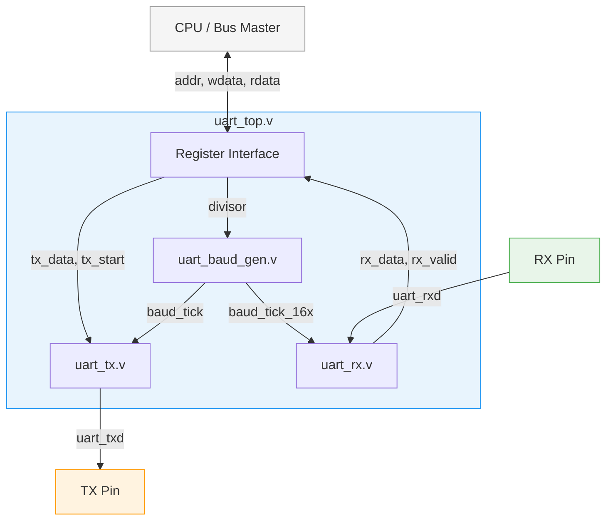
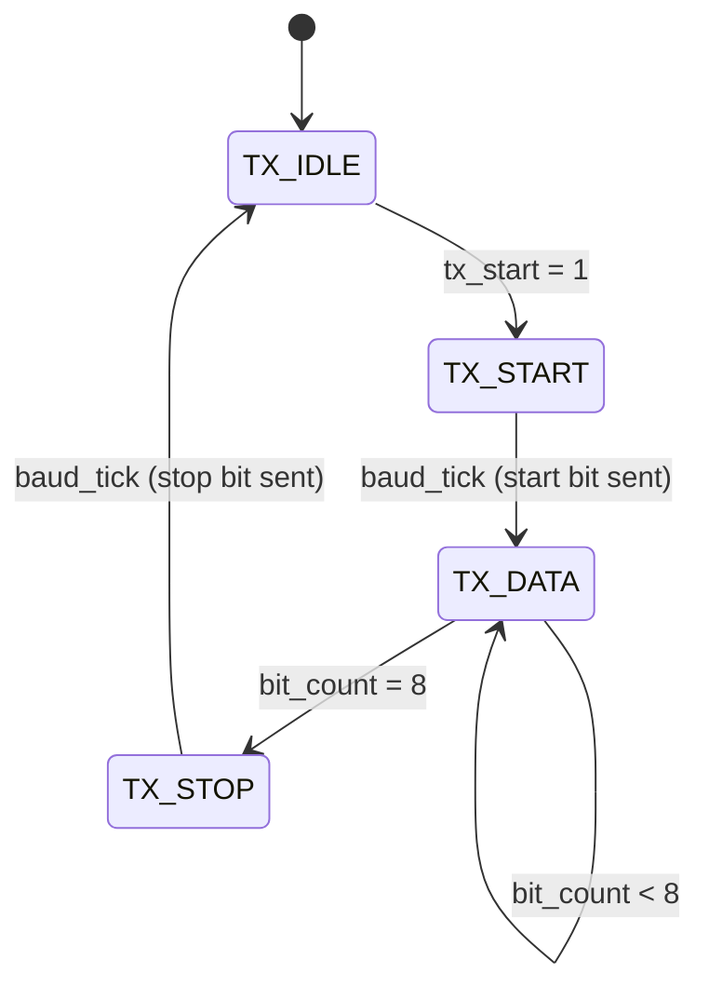
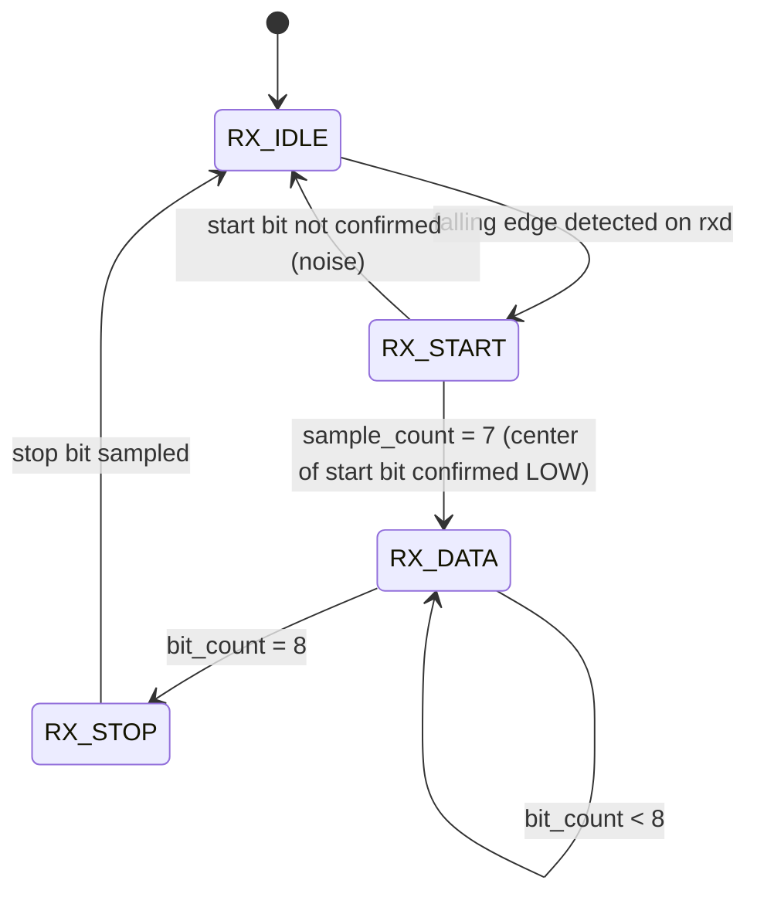
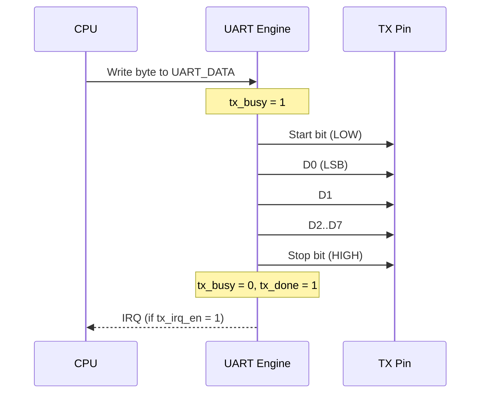
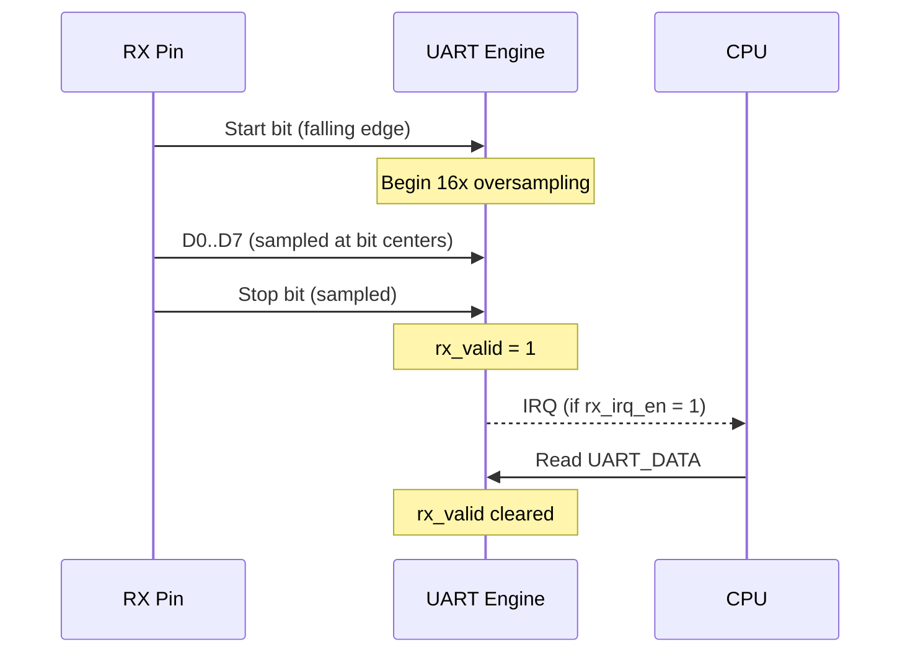
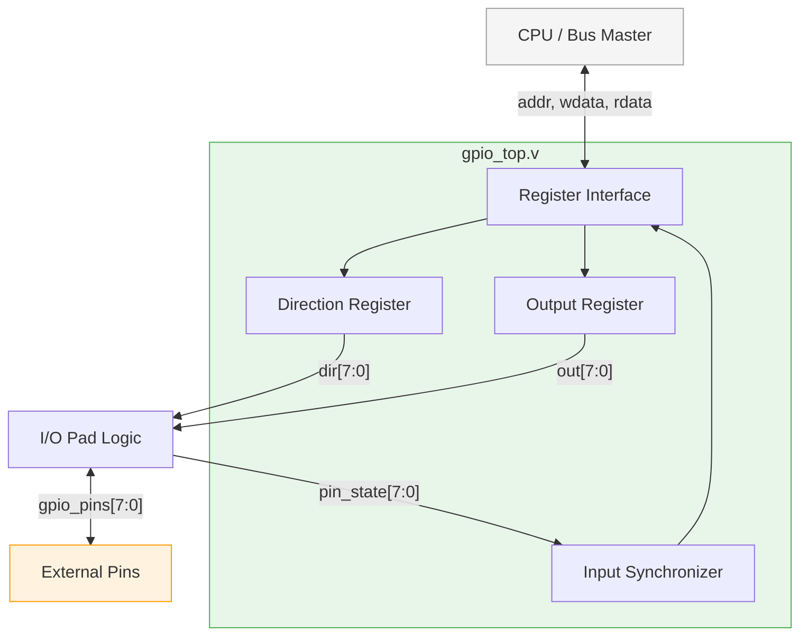
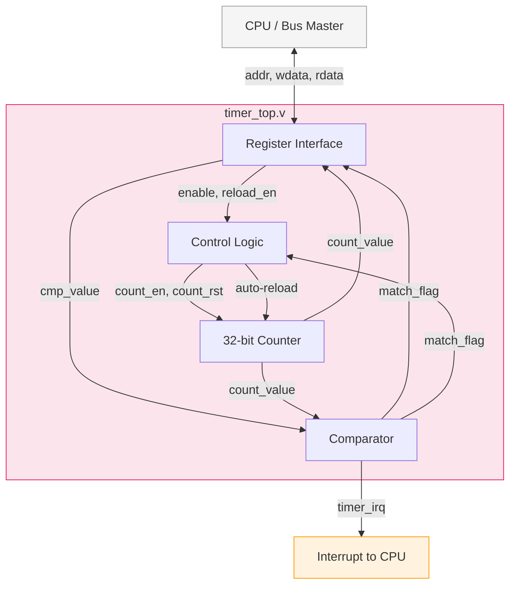
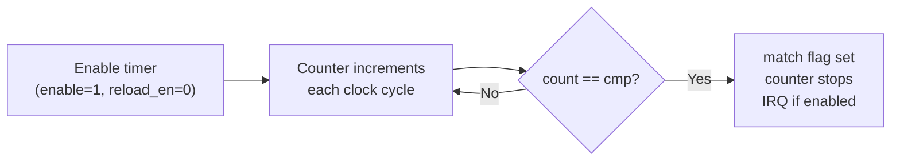
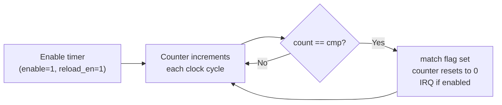

# Peripherals — UART, GPIO & Timer

> **RISC-Shield SoC — Peripheral Documentation**
>
> Module path: `rtl/peripherals/`
> Bus interface: Memory-mapped (simple bus)
> Peripherals covered: UART, GPIO, Timer

---

## Table of Contents

1. [Overview](#overview)
2. [UART](#uart)
   - [UART Overview](#uart-overview)
   - [UART Architecture](#uart-architecture)
   - [UART Module Descriptions](#uart-module-descriptions)
   - [UART Data Format](#uart-data-format)
   - [UART Baud Rate Configuration](#uart-baud-rate-configuration)
   - [UART Register Interface](#uart-register-interface)
   - [UART Timing Diagrams](#uart-timing-diagrams)
   - [UART Loopback Test](#uart-loopback-test)
3. [GPIO](#gpio)
   - [GPIO Overview](#gpio-overview)
   - [GPIO Architecture](#gpio-architecture)
   - [GPIO Module Description](#gpio-module-description)
   - [GPIO Register Interface](#gpio-register-interface)
   - [GPIO Usage Examples](#gpio-usage-examples)
4. [Timer](#timer)
   - [Timer Overview](#timer-overview)
   - [Timer Architecture](#timer-architecture)
   - [Timer Module Description](#timer-module-description)
   - [Timer Register Interface](#timer-register-interface)
   - [Timer Operation Modes](#timer-operation-modes)
5. [Peripheral Memory Map Summary](#peripheral-memory-map-summary)
6. [Integration Notes](#integration-notes)

---

## Overview

The RISC-Shield SoC includes three essential peripherals for communication, I/O control, and timekeeping:

| Peripheral | Function                     | Width  | Key Feature                |
|------------|------------------------------|--------|----------------------------|
| **UART**   | Serial communication         | 8 bits | Full-duplex, configurable baud |
| **GPIO**   | General-purpose I/O          | 8 bits | Bidirectional, per-pin direction |
| **Timer**  | Programmable timer/counter   | 32 bits| Compare match, auto-reload, IRQ |

All peripherals are memory-mapped and accessible via the SoC bus. Refer to [memory_map.md](memory_map.md) for base address assignments.

---

## UART

### UART Overview

The UART (Universal Asynchronous Receiver/Transmitter) provides **full-duplex serial communication** with a configurable baud rate. It supports the standard **8N1 frame format** and is suitable for debug console output, sensor communication, and inter-chip data transfer.

| Parameter          | Value                              |
|--------------------|------------------------------------|
| Data width         | 8 bits                             |
| Frame format       | 8N1 (8 data, no parity, 1 stop)   |
| Duplex             | Full-duplex (independent TX & RX)  |
| Baud rate          | Configurable via clock divisor     |
| FIFO               | Optional (1-deep register by default) |
| Interrupts         | TX empty, RX data available        |

---

### UART Architecture



---

### UART Module Descriptions

#### `uart_baud_gen.v` — Baud Rate Generator

| Property       | Detail                                                      |
|----------------|--------------------------------------------------------------|
| **Function**   | Generate baud-rate tick from system clock                     |
| **Type**       | Sequential (counter-based)                                   |
| **Input**      | `clk`, `rst_n`, `divisor [15:0]`                            |
| **Output**     | `baud_tick` (1× baud), `baud_tick_16x` (16× baud for RX)   |

The baud rate generator divides the system clock to produce timing ticks for the transmitter and receiver:

```
baud_rate = clk_freq / (divisor + 1)
```

**Example configurations** (assuming 50 MHz system clock):

| Baud Rate | Divisor Value | Actual Baud  | Error   |
|-----------|---------------|--------------|---------|
| 9600      | 5207          | 9600.6       | 0.006%  |
| 19200     | 2603          | 19201.2      | 0.006%  |
| 38400     | 1301          | 38401.2      | 0.003%  |
| 115200    | 433           | 115207.4     | 0.006%  |
| 921600    | 53            | 925925.9     | 0.47%   |

The receiver uses a **16× oversampled** tick (`baud_tick_16x`) to accurately sample the incoming data at the center of each bit period.

#### Port Interface

```verilog
module uart_baud_gen (
    input  wire        clk,
    input  wire        rst_n,
    input  wire [15:0] divisor,     // Clock divisor value
    output reg         baud_tick,    // 1x baud rate tick (for TX)
    output reg         baud_tick_16x // 16x baud rate tick (for RX sampling)
);
```

---

#### `uart_tx.v` — Transmitter

| Property       | Detail                                                      |
|----------------|--------------------------------------------------------------|
| **Function**   | Serialize 8-bit data into UART frame for transmission        |
| **Type**       | Sequential (shift-register based FSM)                        |
| **Input**      | `clk`, `rst_n`, `tx_data [7:0]`, `tx_start`, `baud_tick`   |
| **Output**     | `uart_txd` (serial output), `tx_busy`, `tx_done`            |

The transmitter serializes an 8-bit data byte into the UART frame format (start bit + 8 data bits + stop bit). It uses a **shift register** clocked by the baud tick.

**Transmitter FSM States:**



| State      | TXD Line | Description                              |
|------------|----------|------------------------------------------|
| `TX_IDLE`  | HIGH     | Line idle, waiting for data              |
| `TX_START` | LOW      | Transmitting start bit (logic 0)        |
| `TX_DATA`  | Data     | Transmitting 8 data bits, LSB first     |
| `TX_STOP`  | HIGH     | Transmitting stop bit (logic 1)         |

#### Port Interface

```verilog
module uart_tx (
    input  wire        clk,
    input  wire        rst_n,
    input  wire [7:0]  tx_data,     // Parallel data to transmit
    input  wire        tx_start,    // Pulse to begin transmission
    input  wire        baud_tick,   // Baud rate clock enable
    output reg         uart_txd,    // Serial data output
    output wire        tx_busy,     // High while transmitting
    output reg         tx_done      // Pulse when transmission complete
);
```

---

#### `uart_rx.v` — Receiver

| Property       | Detail                                                      |
|----------------|--------------------------------------------------------------|
| **Function**   | Deserialize UART frame into 8-bit parallel data              |
| **Type**       | Sequential (shift-register based FSM with oversampling)      |
| **Input**      | `clk`, `rst_n`, `uart_rxd` (serial input), `baud_tick_16x` |
| **Output**     | `rx_data [7:0]`, `rx_valid` (pulse), `rx_error`             |

The receiver detects the falling edge of the start bit, then samples data at the **center of each bit period** using 16× oversampling. This provides robust noise immunity and accurate bit detection.

**Receiver FSM States:**



**16× Oversampling Strategy:**

```
          Start Bit        D0       D1       D2      ...      D7       Stop Bit
RXD:   __|________|________|________|________|________|________|________|________
              ↑                ↑        ↑        ↑                 ↑        ↑
         Sample at         Sample   Sample   Sample            Sample   Sample
         count = 7         center   center   center            center   center
         (confirm LOW)
```

The receiver counts 16 ticks per bit period. At tick 7–8 (the center), it samples the RXD line. This ensures sampling occurs at the most stable point of each bit.

#### Port Interface

```verilog
module uart_rx (
    input  wire        clk,
    input  wire        rst_n,
    input  wire        uart_rxd,     // Serial data input
    input  wire        baud_tick_16x,// 16x oversampled baud tick
    output reg  [7:0]  rx_data,      // Received parallel data
    output reg         rx_valid,     // Pulse: data byte received
    output reg         rx_error      // Framing error (stop bit not HIGH)
);
```

---

#### `uart_top.v` — UART Top Level

| Property       | Detail                                                      |
|----------------|--------------------------------------------------------------|
| **Function**   | Register interface and integration of UART sub-modules       |
| **Type**       | Sequential + Combinational                                   |
| **Sub-modules**| `uart_baud_gen`, `uart_tx`, `uart_rx`                       |

Top-level module that provides the bus-facing register interface and instantiates all UART sub-modules.

#### Port Interface

```verilog
module uart_top (
    input  wire        clk,
    input  wire        rst_n,

    // Bus interface
    input  wire [31:0] addr,
    input  wire [31:0] wdata,
    output reg  [31:0] rdata,
    input  wire        wr_en,
    input  wire        rd_en,

    // UART pins
    output wire        uart_txd,
    input  wire        uart_rxd,

    // Interrupt
    output wire        uart_irq
);
```

---

### UART Data Format

The UART uses the standard **8N1** frame format:

```
        1 Start    8 Data Bits       1 Stop
IDLE ─┐  Bit   ┌─────────────────┐   Bit   ┌─ IDLE
      │  (LOW)  │ D0 D1 D2 D3 D4 D5 D6 D7 │  (HIGH) │
      └────────┘                           └────────┘

Bit timing: 1 / baud_rate seconds per bit
Frame duration: 10 bits total (1 start + 8 data + 1 stop)
```

| Field     | Bits | Level           | Description                        |
|-----------|------|-----------------|------------------------------------|
| Idle      | —    | HIGH            | Line remains high when idle        |
| Start bit | 1    | LOW             | Signals beginning of frame         |
| Data bits | 8    | LSB first       | Payload data (D0 sent first)       |
| Parity    | 0    | —               | No parity (8N1 format)             |
| Stop bit  | 1    | HIGH            | Signals end of frame               |

> [!IMPORTANT]
> Data bits are transmitted **LSB first**. Bit D0 is sent immediately after the start bit, and D7 is sent last before the stop bit.

---

### UART Baud Rate Configuration

The baud rate is configured by writing a 16-bit divisor value to the `UART_CTRL` register:

```
baud_rate = clk_freq / (divisor + 1)
```

Rearranging to calculate the required divisor:

```
divisor = (clk_freq / baud_rate) - 1
```

> [!TIP]
> For a 50 MHz clock targeting 115200 baud: `divisor = (50,000,000 / 115,200) - 1 = 433`. Write `433` (decimal) or `0x01B1` (hex) to the divisor field.

---

### UART Register Interface

> Suggested base address: `0x4000_0000`

| Offset | Name         | Width | Access | Description                           |
|--------|-------------|-------|--------|---------------------------------------|
| `0x00` | `UART_DATA` | 32    | R/W    | TX data (write) / RX data (read)      |
| `0x04` | `UART_CTRL` | 32    | R/W    | Control and baud rate divisor         |
| `0x08` | `UART_STATUS`| 32   | R      | Status flags                          |

#### UART_DATA Register (Offset `0x00`)

| Bit(s)  | Field      | Access | Description                                          |
|---------|------------|--------|------------------------------------------------------|
| 7:0     | `data`     | R/W    | **Write**: byte to transmit. **Read**: last received byte. |
| 31:8    | Reserved   | —      | Reserved, reads as 0.                                |

- **Write**: Writing to this register loads the TX shift register and initiates transmission.
- **Read**: Reading returns the most recently received byte. `rx_valid` in status is cleared on read.

#### UART_CTRL Register (Offset `0x04`)

| Bit(s)  | Field      | Access | Reset | Description                                  |
|---------|------------|--------|-------|----------------------------------------------|
| 15:0    | `divisor`  | R/W    | 0     | Baud rate divisor. `baud = clk / (div + 1)` |
| 16      | `tx_irq_en`| R/W    | 0     | Enable interrupt when TX completes.          |
| 17      | `rx_irq_en`| R/W    | 0     | Enable interrupt when RX data available.     |
| 31:18   | Reserved   | —      | 0     | Reserved.                                    |

#### UART_STATUS Register (Offset `0x08`)

| Bit(s)  | Field       | Access | Description                                          |
|---------|-------------|--------|------------------------------------------------------|
| 0       | `tx_busy`   | R      | HIGH while transmitter is sending a frame.           |
| 1       | `rx_valid`  | R      | HIGH when a new byte has been received (cleared on data read). |
| 2       | `rx_error`  | R      | HIGH if framing error detected (stop bit not HIGH).  |
| 3       | `tx_done`   | R      | HIGH when last transmission completed successfully.  |
| 31:4    | Reserved    | —      | Reserved.                                            |

---

### UART Timing Diagrams

#### Transmission Timing



#### Reception Timing



---

### UART Loopback Test

For self-testing without external hardware, connect the TX output back to the RX input:

```
                    ┌──────────────┐
                    │   uart_top   │
        Bus ◄──────►│              │
                    │  uart_txd ───┼──┐
                    │              │  │ Loopback wire
                    │  uart_rxd ───┼──┘
                    └──────────────┘
```

**Loopback Test Procedure:**

1. Configure baud rate by writing divisor to `UART_CTRL`.
2. Externally connect (or mux) `uart_txd` to `uart_rxd`.
3. Write a known byte (e.g., `0xA5`) to `UART_DATA`.
4. Wait for `tx_done` (transmission complete).
5. Wait for `rx_valid` (byte received).
6. Read `UART_DATA` and verify the received byte matches `0xA5`.

> [!NOTE]
> In simulation, the loopback connection can be made directly in the testbench. On an FPGA, a dedicated loopback mux controlled by a register bit is recommended.

---

## GPIO

### GPIO Overview

The GPIO (General-Purpose Input/Output) peripheral provides **8 bidirectional I/O pins** with software-configurable direction. Each pin can be independently configured as an input or output.

| Parameter          | Value                          |
|--------------------|---------------------------------|
| Width              | 8 bits (8 pins)                |
| Direction          | Per-pin configurable (I/O)     |
| Output type        | Push-pull                      |
| Input synchronizer | 2-stage flip-flop (metastability protection) |
| Interrupts         | Optional (edge/level detect)   |

---

### GPIO Architecture



### Per-Pin Logic

For each GPIO pin `i` (0 ≤ i ≤ 7):

```
                      dir[i]
                        │
                  ┌─────┴─────┐
                  │  Tri-state │
  out[i] ────────►│   Buffer   ├────────► gpio_pin[i]
                  └────────────┘             │
                                             │
  in[i]  ◄──── [Sync FF1] ◄── [Sync FF0] ◄──┘
```

- When `dir[i] = 1` (output mode): The pin is driven by `out[i]`.
- When `dir[i] = 0` (input mode): The pin is high-impedance; the pin state is read through a 2-stage synchronizer into `in[i]`.

> [!WARNING]
> The input synchronizer adds a **2-cycle latency** to input readings. This is necessary to prevent metastability when sampling asynchronous external signals.

---

### GPIO Module Description

#### `gpio_top.v`

| Property       | Detail                                                      |
|----------------|--------------------------------------------------------------|
| **Function**   | 8-bit bidirectional GPIO with register interface              |
| **Type**       | Sequential + Combinational                                   |
| **Input**      | `clk`, `rst_n`, bus signals, `gpio_in [7:0]`                |
| **Output**     | `gpio_out [7:0]`, `gpio_oe [7:0]`, `gpio_irq`              |

#### Port Interface

```verilog
module gpio_top (
    input  wire        clk,
    input  wire        rst_n,

    // Bus interface
    input  wire [31:0] addr,
    input  wire [31:0] wdata,
    output reg  [31:0] rdata,
    input  wire        wr_en,
    input  wire        rd_en,

    // GPIO pins
    input  wire [7:0]  gpio_in,    // Pin input values (active always)
    output reg  [7:0]  gpio_out,   // Pin output values
    output reg  [7:0]  gpio_oe,    // Output enable (1 = output, 0 = input/hi-Z)

    // Interrupt
    output wire        gpio_irq
);
```

> [!NOTE]
> On an FPGA, the `gpio_in`, `gpio_out`, and `gpio_oe` signals connect to the I/O pad's input, output, and output-enable ports respectively. The actual tri-state buffer is implemented at the pad level.

---

### GPIO Register Interface

> Suggested base address: `0x4001_0000`

| Offset | Name         | Width | Access | Description                          |
|--------|-------------|-------|--------|--------------------------------------|
| `0x00` | `GPIO_DIR`  | 32    | R/W    | Direction register (per-pin)         |
| `0x04` | `GPIO_OUT`  | 32    | R/W    | Output data register                 |
| `0x08` | `GPIO_IN`   | 32    | R      | Input data register (read-only)      |

#### GPIO_DIR Register (Offset `0x00`)

| Bit(s)  | Field      | Access | Reset | Description                                 |
|---------|------------|--------|-------|---------------------------------------------|
| 7:0     | `dir`      | R/W    | 0x00  | Per-pin direction. `1` = output, `0` = input. |
| 31:8    | Reserved   | —      | 0     | Reserved, reads as 0.                       |

#### GPIO_OUT Register (Offset `0x04`)

| Bit(s)  | Field      | Access | Reset | Description                                 |
|---------|------------|--------|-------|---------------------------------------------|
| 7:0     | `out`      | R/W    | 0x00  | Output value for pins configured as output. |
| 31:8    | Reserved   | —      | 0     | Reserved, reads as 0.                       |

#### GPIO_IN Register (Offset `0x08`)

| Bit(s)  | Field      | Access | Reset | Description                                 |
|---------|------------|--------|-------|---------------------------------------------|
| 7:0     | `in`       | R      | —     | Current state of all GPIO pins (synchronized). |
| 31:8    | Reserved   | —      | 0     | Reserved, reads as 0.                       |

> [!TIP]
> Pins configured as outputs still reflect their driven value in `GPIO_IN`, which can be used for read-back verification.

---

### GPIO Usage Examples

#### Example 1: Configure Pin 0 as Output, Drive HIGH

```c
// Set pin 0 as output (bit 0 = 1)
*(volatile uint32_t *)(GPIO_BASE + 0x00) = 0x01;

// Drive pin 0 HIGH
*(volatile uint32_t *)(GPIO_BASE + 0x04) = 0x01;
```

#### Example 2: Read Input Pins

```c
// Ensure pins 7:4 are configured as inputs (bits 7:4 = 0)
uint32_t dir = *(volatile uint32_t *)(GPIO_BASE + 0x00);
dir &= 0x0F;  // Clear bits 7:4
*(volatile uint32_t *)(GPIO_BASE + 0x00) = dir;

// Read current pin state
uint32_t pin_state = *(volatile uint32_t *)(GPIO_BASE + 0x08);
uint8_t input_bits = (pin_state >> 4) & 0x0F;  // Read pins 7:4
```

#### Example 3: Toggle an LED on Pin 3

```c
// Set pin 3 as output
*(volatile uint32_t *)(GPIO_BASE + 0x00) |= (1 << 3);

// Toggle
uint32_t current = *(volatile uint32_t *)(GPIO_BASE + 0x04);
*(volatile uint32_t *)(GPIO_BASE + 0x04) = current ^ (1 << 3);
```

---

## Timer

### Timer Overview

The Timer peripheral provides a **32-bit programmable up-counter** with compare match functionality. It is suitable for generating periodic interrupts, measuring time intervals, and creating software delays.

| Parameter          | Value                              |
|--------------------|------------------------------------|
| Counter width      | 32 bits                            |
| Clock source       | System clock (1 tick per cycle)    |
| Compare match      | Yes (32-bit compare register)      |
| Auto-reload        | Configurable                       |
| Interrupt          | On compare match (maskable)        |
| Prescaler          | Optional (divide system clock)     |

---

### Timer Architecture



---

### Timer Module Description

#### `timer_top.v`

| Property       | Detail                                                      |
|----------------|--------------------------------------------------------------|
| **Function**   | 32-bit programmable timer with compare match and auto-reload |
| **Type**       | Sequential                                                   |
| **Input**      | `clk`, `rst_n`, bus signals                                 |
| **Output**     | `timer_irq`                                                 |

#### Port Interface

```verilog
module timer_top (
    input  wire        clk,
    input  wire        rst_n,

    // Bus interface
    input  wire [31:0] addr,
    input  wire [31:0] wdata,
    output reg  [31:0] rdata,
    input  wire        wr_en,
    input  wire        rd_en,

    // Interrupt
    output wire        timer_irq
);
```

#### Internal Operation

```verilog
// Simplified counter logic
always @(posedge clk or negedge rst_n) begin
    if (!rst_n) begin
        count <= 32'd0;
        match_flag <= 1'b0;
    end else if (enable) begin
        if (count == cmp_value) begin
            match_flag <= 1'b1;
            if (reload_en)
                count <= 32'd0;     // Auto-reload: reset to 0
            else
                count <= count;     // One-shot: stop counting
        end else begin
            count <= count + 32'd1;
        end
    end
end
```

---

### Timer Register Interface

> Suggested base address: `0x4002_0000`

| Offset | Name           | Width | Access | Description                         |
|--------|----------------|-------|--------|-------------------------------------|
| `0x00` | `TIMER_CTRL`   | 32    | R/W    | Control register                    |
| `0x04` | `TIMER_COUNT`  | 32    | R/W    | Current counter value               |
| `0x08` | `TIMER_CMP`    | 32    | R/W    | Compare match value                 |
| `0x0C` | `TIMER_STATUS` | 32    | R/W1C | Status flags                        |

#### TIMER_CTRL Register (Offset `0x00`)

| Bit(s)  | Field       | Access | Reset | Description                                  |
|---------|-------------|--------|-------|----------------------------------------------|
| 0       | `enable`    | R/W    | 0     | `1` = counter is running, `0` = stopped.     |
| 1       | `reload_en` | R/W    | 0     | `1` = auto-reload on match, `0` = one-shot.  |
| 2       | `irq_en`    | R/W    | 0     | `1` = enable interrupt on compare match.      |
| 31:3    | Reserved    | —      | 0     | Reserved.                                     |

#### TIMER_COUNT Register (Offset `0x04`)

| Bit(s)  | Field      | Access | Reset | Description                                 |
|---------|------------|--------|-------|---------------------------------------------|
| 31:0    | `count`    | R/W    | 0     | Current counter value. Writable for preset. |

> [!NOTE]
> Writing to `TIMER_COUNT` while the timer is running loads a new counter value. The counter continues from the written value on the next clock cycle.

#### TIMER_CMP Register (Offset `0x08`)

| Bit(s)  | Field      | Access | Reset      | Description                                 |
|---------|------------|--------|------------|---------------------------------------------|
| 31:0    | `cmp`      | R/W    | 0xFFFFFFFF | Compare match value. Match occurs when `count == cmp`. |

#### TIMER_STATUS Register (Offset `0x0C`)

| Bit(s)  | Field       | Access | Reset | Description                                  |
|---------|-------------|--------|-------|----------------------------------------------|
| 0       | `match`     | R/W1C  | 0     | Set when `count == cmp`. Write `1` to clear. |
| 31:1    | Reserved    | —      | 0     | Reserved.                                     |

> [!IMPORTANT]
> The `match` flag uses **Write-1-to-Clear (W1C)** semantics. The CPU must write a `1` to bit 0 to clear the flag. Writing `0` has no effect. This prevents accidental clearing during read-modify-write operations.

---

### Timer Operation Modes

#### Mode 1: One-Shot Timer

In one-shot mode (`reload_en = 0`), the counter increments until it reaches the compare value, then stops.



**Use case**: Software delay, one-time timeout, watchdog-style timeout.

#### Mode 2: Auto-Reload (Periodic) Timer

In auto-reload mode (`reload_en = 1`), the counter resets to 0 on compare match and continues counting, creating a periodic interrupt source.



**Use case**: Periodic interrupt (e.g., 1 ms tick for RTOS scheduler), PWM timebase, heartbeat.

#### Timing Example

For a **1 ms periodic interrupt** with a 50 MHz system clock:

```
Compare value = (clk_freq × period) - 1
             = (50,000,000 × 0.001) - 1
             = 49,999

Configuration:
  TIMER_CMP    = 49999 (0x0000C34F)
  TIMER_CTRL   = 0x07  (enable=1, reload_en=1, irq_en=1)
  TIMER_COUNT  = 0     (start from zero)
```

---

## Peripheral Memory Map Summary

The following table provides a unified view of all peripheral register addresses. Refer to [memory_map.md](memory_map.md) for the complete SoC memory map.

| Base Address   | Peripheral | Register       | Offset | Absolute Address |
|----------------|------------|----------------|--------|------------------|
| `0x4000_0000`  | UART       | `UART_DATA`    | `0x00` | `0x4000_0000`    |
|                |            | `UART_CTRL`    | `0x04` | `0x4000_0004`    |
|                |            | `UART_STATUS`  | `0x08` | `0x4000_0008`    |
| `0x4001_0000`  | GPIO       | `GPIO_DIR`     | `0x00` | `0x4001_0000`    |
|                |            | `GPIO_OUT`     | `0x04` | `0x4001_0004`    |
|                |            | `GPIO_IN`      | `0x08` | `0x4001_0008`    |
| `0x4002_0000`  | Timer      | `TIMER_CTRL`   | `0x00` | `0x4002_0000`    |
|                |            | `TIMER_COUNT`  | `0x04` | `0x4002_0004`    |
|                |            | `TIMER_CMP`    | `0x08` | `0x4002_0008`    |
|                |            | `TIMER_STATUS` | `0x0C` | `0x4002_000C`    |

---

## Integration Notes

### Bus Connection

All three peripherals connect to the SoC bus through a **bus decoder** (address decoder) that routes transactions based on the upper address bits:

```
Bus Master (CPU)
      │
      ▼
┌─────────────┐
│ Bus Decoder  │
│ (addr[31:16])│
├──────┬───────┤
│      │       │
▼      ▼       ▼
UART   GPIO   Timer
0x4000 0x4001  0x4002
```

### Interrupt Routing

All peripheral interrupts are active-high, active for one cycle (pulse) or level-held until cleared:

| Peripheral | IRQ Signal   | Type  | Clear Mechanism                    |
|------------|-------------|-------|------------------------------------|
| UART       | `uart_irq`  | Level | Cleared by reading `UART_DATA` or status |
| GPIO       | `gpio_irq`  | Edge  | Cleared by writing to interrupt clear register (if implemented) |
| Timer      | `timer_irq` | Level | Cleared by writing `1` to `TIMER_STATUS.match` |

### Reset Behavior

On system reset (`rst_n = 0`):

- All control registers reset to `0` (peripherals disabled).
- All output registers reset to `0`.
- All status flags are cleared.
- UART TX line goes HIGH (idle state).
- GPIO output-enable is `0` (all pins are inputs / high-impedance).
- Timer counter resets to `0`.

### Clock Domain

All three peripherals operate in the **system clock domain** (`clk`). No clock domain crossing logic is needed within the peripherals themselves. The GPIO input synchronizer handles external asynchronous signals entering the clock domain.

---

> **Document version:** 1.0
> **Last updated:** 2026-07-11
> **Author:** Aditya Patel (original design by Dhruv Singla)
